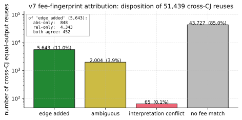
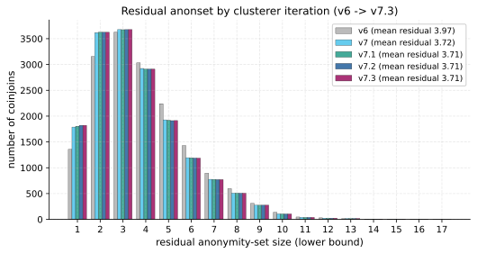

# JoinMarket Maker Wallet Clustering and Taker Anonymity-Set Reduction

> **TL;DR.** JoinMarket holds up well in practice. On one year
> of mainnet activity (10,368 CoinJoins), a passive on-chain
> adversary using only protocol-forced signals trims the mean
> anonymity set from 7.61 to 6.86 equal outputs per CJ at
> precision = 1.0, a 9.8% reduction. 48.5% of CJs leak no
> maker at all; only 0.22% collapse to the taker alone. The
> single dominant edge is the *fee fingerprint*: when a maker's
> realized per-slot fee in a later CJ uniquely matches one
> producer slot in the earlier CJ, the equal output is bound to
> that slot. The mitigation is *fee-policy homogenization*:
> when every maker runs the reference client's default policy,
> the fingerprint stops disambiguating and the residual returns
> to the $n_{eq}$ ceiling ([§9.3](#countermeasure-simulator-evaluation)).
> The fix is not unilateral: a single taker who jitters their
> own fee no longer leaks their own slot, but the CJs they
> participate in still expose the *other* makers as long as
> those makers run varied policies, and the taker's own slot
> can often be re-identified by comparison with surrounding
> rounds. Effective mitigation requires the whole network to
> converge on a uniform default. The protocol is robust today
> and improvable.

## 1. Scope and motivation

A JoinMarket CoinJoin (CJ) is an atomic transaction in which one
*taker* and $M$ *makers* contribute inputs and produce
$n_{eq} = M + 1$ equal-amount outputs (the *equal outputs*) plus
up to $n_{eq}$ change outputs (one per participant who needs
change; typically all $M$ makers and usually the taker too). Each
participant contributes one *slot*: a bundle of one or more
inputs they own, exactly one equal-amount output, and at most one
change output. The published anonymity property is that the
taker's equal output is indistinguishable from the makers' equal
outputs: the taker hides in a set of $n_{eq}$ candidates per
round.

JoinMarket defends this set in several layered ways:

- Both makers and takers run the same wallet software and keep
  funds in five separate *mixdepths* (numbered $d \in
  \{0, 1, 2, 3, 4\}$). A single slot uses inputs from one
  mixdepth only; the equal output goes to mixdepth
  $d{+}1 \bmod 5$ of the same wallet (the equal output is the
  part that gained privacy and gets to advance); the change
  output stays at mixdepth $d$ (its address derivation belongs to
  the same mixdepth as the inputs, and JoinMarket clients refuse
  to co-spend UTXOs across mixdepths). Outputs from different
  mixdepths of the same wallet are therefore never co-spent
  inside the wallet without an explicit consolidation step in
  the client.
- Each maker advertises offers on the JoinMarket directory-server
  overlay. Today the overlay is a small set of directory nodes
  that relay (often end-to-end encrypted) Tor messages between
  participants; earlier versions used IRC. Nicks are randomized
  per session, and offers can be advertised either with or
  without a fidelity bond. A *fidelity bond* (FB) is a timelocked
  P2WSH UTXO the maker proves they control; bondless offers can
  be advertised freely and are therefore trivially Sybil-able,
  so takers in practice almost always select bonded makers (the
  taker selection algorithm weights by bond value). The FB is
  the only durable label a passive observer sees, and the
  orderbook publishes it in cleartext.
- The taker's identity at round $T$ does not, by itself, leak
  which of the $n_{eq}$ equal outputs it owns.

This paper studies what the same passive adversary *can* still
learn from on-chain data. The central observation is that a maker
who participates in two CJs leaves a deterministic same-wallet
*slot* edge in the chain: either an equal output of CJ $T$ (at
mixdepth $d{+}1$) reused as a maker input in CJ $S$ (the maker
later advertising mixdepth $d{+}1$), or a change output of $T$
(at mixdepth $d$) reused later when the maker advertises $d$
again. Following those edges clusters maker *slots* across CJs.
Cluster membership reduces the taker's hide-set in CJ $T$ only
when an equal output of $T$ can be individually attributed to a
specific producer slot; this attribution requires the
fee-fingerprint signal of [§5.2](#v7-fee-fingerprint-equal-output-attribution) (or, in a small number of
cases, a downstream co-spend with a cluster-mate's already
attributed output). Slot clustering alone is necessary but not
sufficient for taker anonymity-set reduction.

This paper answers:

1. How many JoinMarket maker wallets can be clustered from
   on-chain data alone, at precision = 1.0 (under the gate and
   corpus described in [§5.2](#v7-fee-fingerprint-equal-output-attribution) and [§6.1](#simulator-end-to-end-and-the-v7-gate-hierarchy)), on the mainnet
   corpus?
2. By how much does that clustering reduce the per-CJ taker
   anonymity set, once we restrict to the certification channel
   that can actually identify an individual equal output (fee
   fingerprint and the small number of co-spend cases that lift
   on top of it)?
3. Are the resulting clusters protocol-correct against an
   independent ground-truth source (an active probing campaign
   that collects real maker UTXO-to-nick bindings)?

## 2. Threat model

Passive on-chain adversary with full corpus access:

- a snapshot of every JoinMarket CoinJoin reachable by a forward
  and backward crawl seeded from probe-collected addresses. The
  crawl covers the public mainnet history through May 2026 and
  finds 23,876 JM-flagged CJs going back to mid-2021, though the
  density is heavily skewed to the last ~14 months (75% of the
  decoded CJs sit in 2025-04 onward);
- the public orderbook
  ([joinmarket-ng.sgn.space/orderbook.json](https://joinmarket-ng.sgn.space/orderbook.json));
- the ability to solve a CJ-sized ILP (less than 30 inputs);
- compute on the order of CPU-hours (the full corpus pass fits in
  under 15 minutes on 14 cores).

The adversary does *not* participate in any CoinJoin and is not
assumed to control any maker. We did run a small off-chain
probing campaign in late April 2026 (three rounds, 72 maker nicks,
described in [§6.2](#active-probing-of-real-maker-wallets)) that contributed seed addresses to the corpus
crawl and is reused as a ground-truth oracle in [§6](#ground-truth-validation). The probing
was done in good faith, at the smallest size that still gives a
useful precision check. To avoid republishing privacy-sensitive
on-chain identifiers, the probe artefacts kept in this
repository are reduced to per-nick advertised-UTXO *counts* and
the precision-check outcomes (matched-nick set, cross-nick
collision counts); we deliberately do not publish the maker
outpoints, amounts, addresses, or fidelity-bond UTXOs collected
during probing. The probing data contributes nothing to the
clustering itself.

## 3. JoinMarket protocol primer

Three protocol facts are load-bearing for the clusterer:

1. **Per-CJ slot uniqueness.** Each participant (taker or maker)
   contributes exactly one slot. A slot may aggregate several
   UTXOs to cover the offered amount, but it always produces one
   equal-amount output and at most one change output, all in the
   same mixdepth.

2. **Same-mixdepth change (sticky change).** A slot whose inputs
   come from mixdepth $d$ lands its change output back in
   mixdepth $d$. This is enforced by the wallet (the change
   address is derived from the same mixdepth's key tree), so the
   change UTXO is eligible to be a future input of the *same
   maker* whenever the maker next advertises mixdepth $d$. The
   downstream consequence is what makes the change-chain edge so
   sharp: if some later CJ slot in our corpus has inputs whose
   ILP-selected combination *exactly* matches this change UTXO
   (typically as one of several inputs in a subset-sum
   decomposition), the two slots are the same wallet by
   construction.

3. **Mixdepth-advancing equal output.** The slot's equal output
   lands in mixdepth $d{+}1 \bmod 5$. JoinMarket makers normally
   advertise from whichever mixdepth currently holds the most
   coins, which after a successful round is often (but not
   always) the mixdepth that just received the equal output.
   Deposits, withdrawals, and consolidations can push the
   "fattest mixdepth" elsewhere, so the next advertisement is not
   forced to be $d{+}1$. When the maker does come back from
   mixdepth $d{+}1$, the equal output of $T$ is a natural input
   for that next slot.

   This produces an "equal-chain" same-wallet edge that v6 does
   not use directly, because within one CJ all $n_{eq}$ equal
   outputs look identical (any permutation of equal-output owners
   is consistent with the ILP-recovered fee constraints).
   Section 5.2 (v7) restores this edge by using the consumer
   slot's own realized fee as a per-CJ fingerprint: if exactly
   one slot in the producer CJ would have charged this fee at the
   producer CJ's amount, we have identified that slot.

Two more JoinMarket details matter for the analysis pipeline:

- A maker offer is *either* relative or absolute, not both
  (`cjfee_r` or `cjfee_a`). Most makers run a single relative
  offer.
- The maker's contribution to the on-chain fee (`txfee`) is 0
  sats in the default policy and across the observed corpus.

The clusterer uses fact 1 as a pairwise must-not-link, fact 2
as a same-wallet must-link, and fact 3 (via the fee-fingerprint
rule of [§5.2](#v7-fee-fingerprint-equal-output-attribution)) as a per-CJ disambiguator. Fees are used
only when they pick a single producer slot inside a single
producer CJ, never as a global fee-band. Fidelity-bond values,
nick patterns and any other off-chain signal are not used
(except [§5.5](#v7-3-fidelity-bond-funding-tx-cioh), which uses the public orderbook to anchor
FB-owner identity to funding-tx inputs). This restriction to
protocol-forced or single-CJ-unambiguous evidence is what gives
precision = 1.0 by construction under the gate and corpus
stated in [§5.2](#v7-fee-fingerprint-equal-output-attribution) and [§6.1](#simulator-end-to-end-and-the-v7-gate-hierarchy).

### 3.1 Worked example

A two-maker CJ at amount 1,000,000 sats with one taker and makers
$A$, $B$. Each maker charges a CoinJoin fee of 1,000 sats; the
miner fee for the whole transaction is 4,000 sats and is paid in
full by the taker (default JoinMarket policy: $\mathit{txfee} = 0$
for each maker offer):

```
inputs (total 4,480,000):
  taker:   2,400,000  (one UTXO from any source)
  A:       1,050,000  (one UTXO from A's mixdepth 1)
  B:         950,000 + 80,000  (two UTXOs, both from B's mixdepth 0)

outputs (total 4,476,000; miner fee = 4,000):
  equal: 1,000,000      (three of them: taker, A, B in unknown order)
  change(taker):  1,394,000  = 2,400,000 - 1,000,000 - 2*1,000 - 4,000
  change(A):         51,000  = 1,050,000 - 1,000,000 + 1,000
  change(B):         31,000  = 1,030,000 - 1,000,000 + 1,000
```

Cashflow per participant (counting only what each wallet sees;
the equal outputs are 1,000,000 each, owned by their respective
participants):

- **Taker**: pays $2 \cdot 1{,}000$ (maker fees) plus $4{,}000$
  (miner fee), a **6,000 sat net cost** for the mix.
- **Maker A**: receives a 1,000,000 equal output and a 51,000
  change output for a total of 1,051,000 against 1,050,000
  inputs, **earning +1,000 sats**.
- **Maker B**: receives a 1,000,000 equal output and a 31,000
  change output for a total of 1,031,000 against 1,030,000
  inputs, **earning +1,000 sats**.
- **Miner**: receives 4,000 sats.

The taker funds both maker payouts and the miner fee; the makers
are paid for providing liquidity. A maker's per-CJ cashflow is
always non-negative (zero for a maker who advertises a zero fee).

The ILP decomposition tells us which subset of inputs and which
change output each participant contributed; it cannot tell which
of the three equal-amount outputs is whose (the equal outputs are
indistinguishable on-chain by amount alone). The change output
for $A$ (51,000 sats in mixdepth 1) will reappear as an input in
some future CJ where $A$ again advertises mixdepth 1; that future
CJ is the chain edge that v6 walks. The same applies to $B$'s
change in mixdepth 0.

The equal outputs go to mixdepth 2 of their respective owners and
become natural inputs for whichever participant next advertises
from mixdepth 2 (the wallet's depth-rotation policy will usually
prefer the fattest mixdepth, which after this CJ is often
mixdepth 2 but not necessarily). When such a reuse happens in a
later CJ $S$, the consumer slot's realized fee in $S$ identifies
the producer slot in $T$ if and only if no other slot in $T$ would
have charged the same fee at $S$'s amount: that is the
fee-fingerprint rule of [§5.2](#v7-fee-fingerprint-equal-output-attribution) in concrete form. For example, if
$A$ charges 0.1% relative and $B$ charges a fixed 800 sats, then
on $S$ at amount $1{,}500{,}000$ the consumer slot's fee would be
1,500 sats if it came from $A$ and 800 sats if it came from $B$:
those values are distinct, so an observer who sees fee 1,500
sats in $S$ for a slot whose first input is one of $T$'s equal
outputs concludes the producer slot was $A$.

## 4. Mainnet corpus

A forward and backward crawl seeded from probe-collected
addresses, walking only outspends from already-classified
JoinMarket CoinJoins, produced the snapshot used here. We
restrict the window to exactly one year of mainnet JoinMarket
activity, block heights 894,697 to 947,358 (UTC dates 2025-05-01
to 2026-05-01):

| metric                | count        |
|-----------------------|-------------:|
| JM CoinJoin txs in window | 10,581 |
| time span             | 1 year (heights 894,697 to 947,358) |
| ILP-decoded CJs (full unique decomposition) | 6,315 (59.7%) |
| CJs with no unique full ILP solution at `max_fee_rel = 0.005`, `max_fee_abs = 10,000 sats`, `time_limit = 2s` | 4,266 (40.3%) |
| of those, partial maker slots recovered ([§7.4](#partial-ilp-slot-recovery)) | 4,219 (98.9%) |
| CJs unanalyzable (no slots at all) | 47 (0.4%) |
| maker slots recovered (full ILP) | 47,097 |
| maker slots recovered (partial ILP, [§7.4](#partial-ilp-slot-recovery)) | 21,621 |
| maker slots, total | 68,718 |

A full ILP *succeeds* when it returns a unique feasible
slot-by-slot decomposition: each slot is a single mixdepth's
worth of inputs summing to exactly one equal output plus one
change output, every maker slot's realized fee
($\mathit{equal\_amt} + \mathit{change\_amt} - \sum \mathit{inputs}$)
is non-negative, and the per-CJ fee budget is respected.
Anything else (solver timeout at 2 s, LP-proved infeasibility,
or a feasible but degenerate solution with unassigned slots) is
classified as *no unique solution*. For these CJs the analyzer
still extracts deterministically-forced maker slots via its
greedy preprocessing pass ([§7.4](#partial-ilp-slot-recovery)); the
partial-only rows feed all downstream stages identically to
full-ILP rows.

CJs that do not decode contribute no slots and no chain edges.
Treating them as missing data is conservative for [§7](#anonymity-set-reduction): any slot
whose downstream remix happens to fall in an ILP-failed CJ looks
like a singleton (uncertified) and *over-reports* residual
anonymity.

The fee envelope $(\mathit{max\_fee\_rel} = 0.005,
\mathit{max\_fee\_abs} = 10{,}000$ sats$)$ is chosen to match the
empirical maker policy distribution: an orderbook snapshot of all
active makers shows realized maxima of $\mathit{reloffer} = 0.004$
and $\mathit{absoffer} = 9{,}644$ sats, so the envelope tightly
bounds the realistic policy space while still admitting every
maker observed on the network. A looser envelope (e.g.
$\mathit{max\_fee\_rel} = 0.05$) admits many spurious feasible
decompositions and inflates the ILP solution multiplicity, which
in turn hides the fee-fingerprint edge of [§5.2](#v7-fee-fingerprint-equal-output-attribution).

## 5. The clusterer

We refer to several incremental versions of the clusterer
throughout the paper. They differ only in which structural edges
are added on top of the previous version; every version is
strictly additive, precision-preserving, and listed in the order
in which the paper introduces them.

| version | new edge                                                  | introduced in                                                |
|---------|-----------------------------------------------------------|--------------------------------------------------------------|
| v6      | within-CJ must-not-link; change-chain must-link           | baseline; described below in this section                    |
| v7      | fee-fingerprint equal-output attribution (single producer slot per consumer slot, when the gate fires) | [§5.2](#v7-fee-fingerprint-equal-output-attribution)         |
| v7.1    | non-CJ co-spend (Common Input Ownership Heuristic) across change UTXOs that appear together in non-CJ spends | [§5.3](#v7-1-non-cj-co-spend-common-input-ownership-heuristic) |
| v7.2    | non-CJ round-trip CIOH (two-output non-CJ spends that reconverge) | [§5.4](#v7-2-non-cj-round-trip-cioh)                         |
| v7.3    | fidelity-bond funding-tx CIOH (anchors a known FB owner to the inputs of its funding tx) | [§5.5](#v7-3-fidelity-bond-funding-tx-cioh)                  |

A "tighter" version always *adds* edges to looser versions; it
never moves or removes them. Numerical headline results in
[§7](#anonymity-set-reduction) are reported under v7.3 (the
strictest), with per-version breakdowns where useful.

The clusterer takes the per-CJ ILP slot decomposition and merges
slots across CJs by structural rules only. It is a
constraint-propagation union-find with the following edges and
constraints:

- **Must-not-link (fact 1).** Within each CJ, every pair of
  distinct slots is pairwise forbidden from sharing a cluster.
  These constraints propagate through transitive merges: if
  cluster `A` absorbs cluster `B`, every node that forbids `B`
  henceforth forbids `A`.
- **Must-link, change-chain (fact 2).** Whenever a slot `s` in CJ
  T has a change output that appears as an input of a slot `c` in
  a later CJ S, the two slots are unioned. The receiver is the
  same maker, now re-advertising the same mixdepth.
- **Must-link, fee-fingerprint attribution (fact 3).** In the
  simulator the equal-output owner is known and v6 unions producer
  with consumer directly. On mainnet, v7 ([§5.2](#v7-fee-fingerprint-equal-output-attribution)) restores this
  same-wallet edge by picking the producer slot from a *fee
  fingerprint* of the consumer slot in the next CJ; the edge
  fires only when that fingerprint identifies exactly one slot in
  the producer CJ, otherwise no edge is added. This is the only
  signal in the attack that ties a specific equal output of $T$
  to a specific producer slot of $T$ ([§7](#anonymity-set-reduction) Path A); the other
  edges in this list (and in [§5.3](#v7-1-non-cj-co-spend-common-input-ownership-heuristic)-[§5.5](#v7-3-fidelity-bond-funding-tx-cioh)) cluster slots
  across CJs but do not attribute equal outputs.

The clusterer uses fees, but only locally: v7's fee-fingerprint
rule ([§5.2](#v7-fee-fingerprint-equal-output-attribution)) selects at most one producer slot inside a single
producer CJ from the $n_{eq}$ equal-output candidates. It does
*not* pool slots across CJs by their advertised
$(\mathit{cjfee}_r, \mathit{cjfee}_a)$ tuple, which is what
earlier fee-band heuristics tried and what would silently union
distinct same-policy makers. Addresses, amounts, fidelity-bond
values, and nick patterns are never used as a clustering signal
by themselves ([§5.5](#v7-3-fidelity-bond-funding-tx-cioh) anchors known FB-owner identity to its own
funding transaction's inputs via CIOH, which is a per-bond
provable same-wallet edge, not a pattern match across bonds).
Every merge is a direct consequence of the protocol. By
construction the clusterer can only *under-cluster*: a maker
whose downstream remix is missing from the corpus (crawl
frontier, ILP failure, or exit from the ecosystem) appears as a
singleton even when their wallet served many more CJs in
reality. Precision is therefore $= 1.0$ by construction under
the gate stated here (see [§5.2](#v7-fee-fingerprint-equal-output-attribution) for the three gate strengths and
[§6.1](#simulator-end-to-end-and-the-v7-gate-hierarchy) for their measured behavior), and recall is bounded below
by the fraction of CJs the corpus successfully observes and
decodes.

### 5.1 Cluster size distribution

The full pass over the 68,718 mainnet slots in the 1y window
produces the following v7.3 final-cluster summary:

| metric                                       | v7.3      |
|----------------------------------------------|----------:|
| total clusters                               |   20,454  |
| singleton clusters                           |   11,272  |
| non-trivial clusters (size $\geq 2$)         |    9,182  |
| largest cluster                              | 388 slots |
| same-CJ slot collisions (must-not-link violations) | 0   |

The zero-collision row is the falsifiability check: two slots of
the same CJ ending up in one cluster would be a hard precision
violation. v6, v7, v7.1, v7.2, v7.3 all pass it on the full
mainnet corpus; the per-edge incremental contributions are
reported in [§7.1](#headline) alongside the residual numbers.


The v7.3 histogram is heavy-tailed but bounded: the largest
cluster contains 388 slots, the 99th percentile is below the
mid-double digits, and the median non-trivial cluster has 3.
There is no cluster of "thousands of slots", which would be the
signature of an over-merge.

### 5.2 v7: fee-fingerprint equal-output attribution

Every maker advertises a single offer (relative $\mathit{cjfee}_r$
or absolute $\mathit{cjfee}_a$, not both) and the on-chain fee
they earn in a CJ is a deterministic function of that offer and
the equal-output amount $a$:

$$
\mathit{fee}(a) \;=\;
\begin{cases}
\mathit{cjfee}_a & \text{(absolute maker)} \\
\mathrm{round\_half\_even}(\mathit{cjfee}_r \cdot a) & \text{(relative maker)},
\end{cases}
$$

where the relative case uses banker's rounding to the nearest
satoshi, matching JoinMarket-NG's
`Decimal(cjfee) * Decimal(amount)`.`quantize(Decimal(1))`
in `jmcore/src/jmcore/bitcoin.py` (and the equivalent path in
joinmarket-clientserver).

The ILP recovers this realized fee per slot from the input total,
equal output, and change output. The fee is observable but not by
itself identifying: thousands of slots share the same
$(\mathit{cjfee}_r, \mathit{cjfee}_a)$ fingerprint across the
corpus, so a global fee-band clusterer would silently merge
distinct same-policy makers.

v7 uses the fee fingerprint locally, *within a single producer
CJ*. When an equal output of producer CJ $T$ is spent as a maker
input of slot $c$ in a later CJ $S$, the consumer slot $c$
carries its own realized fee $f_c$ at amount $a_S$. We then look
at $T$'s maker slots $S_1, \dots, S_n$ (at most about 22 in
practice) and ask: is there exactly one $S_i$ whose advertised
offer would produce $f_c$ at amount $a_S$? Concretely, for each
$S_i$ with realized fee $f_i$ at amount $a_T$ we check the two
admissible interpretations:

- *absolute* match: $f_i = f_c$ (so $S_i$'s policy is
  $\mathit{cjfee}_a = f_c$);
- *relative* match: $f_i / a_T$ and $f_c / a_S$ agree to the
  nearest part per million. Each side's ppm value is computed
  in integer arithmetic over the satoshi-denominated fee and
  equal-amount: $\mathrm{ppm}(f, a) = \mathrm{banker\_round}(f
  \cdot 10^6 / a)$, evaluated as a single `divmod` on
  arbitrary-precision integers so that no float64 truncation
  enters the equality test. Two slots match on the relative
  fingerprint iff their integer ppm values are equal, which
  in turn implies $S_i$'s policy is $\mathit{cjfee}_r = f_c /
  a_S$ to that resolution.

v7 admits three gate strengths, in increasing order of
precision and decreasing order of recall. All three share the
same enumeration above; they differ only in which of the
enumerated matches becomes a same-wallet edge.

**Per-CJ univocal gate (loose).** The original v7 gate. An edge
is added if and only if exactly one $S_i$ matches under absolute
*or* relative, and the absolute and relative interpretations do
not point at two different slots. Ambiguous within-$T$ matches
and conflicting interpretations are dropped.

**Per-CJ both-interpretations gate (strict).** An edge is added
only when both interpretations independently identify the *same*
$S_i$ as the unique match. This is the
`unique_both_same_slot` subset of the loose gate. It rejects
single-criterion matches whose target slot may have coincidentally
collided with the consumer fingerprint under per-announcement fee
jitter (§6.1).

**Corpus-unique gate.** An edge is added only when the chosen
$S_i$'s fingerprint is, across the entire corpus of v7-enriched
slots, free of doppelgangers: no slot outside $T$ and outside
the consumer $c$ carries the same absolute *or* the same
relative fingerprint. This is strictly stronger than per-CJ
univocality because it requires the producer's fee policy to
be unique in the corpus, not merely unique inside $T$, and the
"or" makes the reject conservative (any single-axis collision
elsewhere in the corpus is enough to drop the edge). The
corpus-unique gate is the one that
restores precision = 1.0 in the controlled simulator
experiment (§6.1, Table). The two per-CJ gates are
heuristic: they preserve precision under sparse fingerprint
collisions, as on the mainnet corpus where the empirical
violation rate is 0 (§6.2), but they cannot guarantee it
under adversarial jitter where many makers concentrate near the
same fee policy.

Empirically on the mainnet corpus (32,430 cross-CJ equal-output
reuses) under the per-CJ loose gate:

| disposition                       |   count  | share  |
|-----------------------------------|---------:|-------:|
| edge added (unique under abs OR rel) | **7,361** | 22.7%  |
|  - abs-only unique                |   1,153  |  3.6%  |
|  - rel-only unique                |   5,666  |  17.5% |
|  - both agree on same slot        |     542  |  1.7%  |
| ambiguous ($\geq 2$ slots match)  |   2,714  |  8.4%  |
| interpretation conflict (abs and rel disagree) | 113 | 0.3% |
| no slot matches                   |  22,242  | 68.6%  |



The 85% no-match share is dominated by reuses where the producer
CJ is not in the corpus (the equal output's parent CJ was crawled
but not ILP-decoded, or was outside the JM crawl). The 65
conflict cases (0.1%) are *dropped* on purpose: they typically
arise when one slot's absolute fee happens to numerically match
another slot's relative fee at a different equal-output amount.
The drop is the precision-preserving move.

The contract is identical to v6's: every added edge is a definite
same-wallet link or no edge at all. v7 inherits v6's same-CJ
must-not-link forbidance through a shared constrained union-find,
so the 7,361 additional merges cannot smuggle a must-not-link
violation through transitivity. We verify this directly on
mainnet (§5.1: 0 collisions, §6.2: 0 cross-nick
collisions). The mainnet headline numbers reported throughout
the rest of this paper use the per-CJ loose gate, since the
empirical violation rate is 0 on this corpus and the recall delta
to the corpus-unique gate is non-trivial. The corpus-unique gate
is the conservative choice when fee-policy density is high or
when an adversarial maker can deliberately jitter fees to forge
edges; see §6.1 for the simulator comparison.

### 5.3 v7.1: non-CJ co-spend (Common Input Ownership Heuristic)

A non-CJ transaction $N$ that consumes two or more change UTXOs
belonging to distinct maker slots reveals same-wallet ownership
of those slots by the Common Input Ownership Heuristic. To
remain at precision = 1.0 we require $N$ to have at most two
outputs: the canonical shape of a consolidation, change return
or simple send, which excludes batched multi-recipient spends
where CIOH would otherwise cross wallet boundaries. Same-CJ
pairs are rejected by the inherited must-not-link constraint.

Empirically on the mainnet corpus:

| metric                                          |   count |
|-------------------------------------------------|--------:|
| qualifying non-CJ spenders ($\leq 2$ outputs)   |      44 |
| same-CJ pairs rejected                          |       0 |
| **cross-CJ unions added**                       |  **95** |

Spenders with three or more outputs are conservatively left
aside (CIOH would otherwise cross wallet boundaries on batched
multi-recipient spends).

### 5.4 v7.2: non-CJ round-trip CIOH

v7.1 caps the spender at two outputs because we cannot prove
same-owner across more. Many real remix flows include a single
non-CJ hop in between two CJs: a maker consumes their change at
mixdepth $d$, rebroadcasts through a two-output hop transaction
$H$ (consolidation, fee bump, deposit echo), and one of $H$'s
outputs becomes an input to a later maker slot. v7.2 fires the
producer-to-consumer union when (1) $H$ has at most two outputs,
(2) $H$ consumes the change of some maker slot $p$, and (3) any
output of $H$ later funds a maker slot $c$. Same-CJ pairs are
again dropped by the inherited forbid-set.

Empirically on the mainnet corpus:

| metric                                                                | count |
|-----------------------------------------------------------------------|------:|
| qualifying non-CJ hops ($\leq 2$ outputs, consuming maker change)     |    70 |
| same-CJ pairs rejected                                                |     0 |
| **cross-CJ unions added**                                             | **103** |

v7.2 adds 103 unions on top of v7.1's 95.

### 5.5 v7.3: fidelity-bond funding-tx CIOH

JoinMarket makers advertise a *fidelity bond* (FB): a timelocked
P2WSH output that the maker proves they own. The orderbook
publishes the nick-to-FB-UTXO mapping in cleartext, so any
passive observer obtains a snapshot. The bond UTXO is timelocked
and almost never spent in our corpus, but the transaction $F$
that *created* it is a regular spend whose inputs are same-wallet
as the FB owner by CIOH.

v7.3 turns that observation into two same-wallet anchors on top
of the v7.2 graph. For nick $N$ owning FB UTXO $(F, v_{FB})$:

* *Backward.* Every input of $F$ is same-wallet as $N$. If that
  input is also the change output of a maker slot $s$, then $s$
  belongs to $N$.
* *Strict forward.* If $F$ has at most two outputs, the non-FB
  output is $N$'s change. If that outpoint later funds a maker
  slot $s'$, then $s' \in N$.

Two slots anchored to the same nick are unioned, subject to the
inherited same-CJ forbid. Two safety guards apply: (1) skip
funding txs that are themselves a JM CJ (CIOH does not hold over
all inputs of a CJ); (2) the constrained union-find drops any
candidate pair sitting in the same CJ.

How are FBs funded in practice? Classifying the inputs of every
FB-funding tx (orderbook snapshot 2026-05-22, 95 FB UTXOs):

| funding-tx class                                                  | count |
|-------------------------------------------------------------------|------:|
| funding tx is itself a JM CJ (skipped)                            |     2 |
| funded entirely from inputs with no observable JM provenance      |    66 |
| funded from a mix of external and JM-derived inputs               |    17 |
| funded from JM-CJ outputs not classified as equal or change       |    10 |
| **total**                                                         |    95 |

Sixty-six of 95 FBs (69%) fund from inputs with no observable JM
provenance: cold storage, exchange withdrawals, or fresh wallets.
This is the privacy-preserving pattern. The 17 mixed funding txs
are the ones that *do* leak a same-wallet edge at one hop and
contribute the backward anchors that v7.3 acts on. Multi-hop
backward CIOH walks could shrink the 69% further and are listed
in [§10](#limitations-and-future-work) as future work.

Empirically:

| metric                                                  | count |
|---------------------------------------------------------|------:|
| FB-funding txs used                                     |    93 |
| backward anchors via maker-slot change                  |    16 |
| strict-forward anchors                                  |     1 |
| nicks spanning $\geq 2$ v7.2 clusters                   |     2 |
| candidate slot pairs                                    |    13 |
| same-CJ pairs rejected                                  |     0 |
| **cross-cluster unions added**                          | **9** |

The nine unions collapse a handful of v7.2 clusters with no
same-CJ collisions. None of the merging nicks appears in our probe set,
so v7.3's contribution is independent of the
[§6.2](#active-probing-of-real-maker-wallets) precision check.
The headline residual is essentially unchanged at this granularity:
v7.3's value is qualitative, demonstrating that
the public orderbook by itself already widens a narrow,
precision-safe same-wallet edge with no probing required.

## 6. Ground-truth validation

We validate the clusterer (v6 through v7.3) against three
independent ground-truth sources, all of which a passive on-chain
analyst would *not* have but which we can construct here.

The precision validation in this section uses a larger 5-year
mainnet corpus (110,154 maker slots from 14,639 ILP-decoded CJs)
to keep the probe and gate-comparison evidence as large as
possible; the 1y window of [§4](#mainnet-corpus) is a subset of this corpus
used for the headline [§7](#anonymity-set-reduction) residual numbers. Precision = 1.0
holds on both corpora: every chain edge in this attack is a
hard same-wallet conclusion, so the corpus choice does not
affect precision, only the absolute cluster counts.

### 6.1 Simulator end-to-end and the v7 gate hierarchy

The accompanying coinjoin-simulator builds a synthetic JoinMarket
network with the same ILP pipeline driving v6 and v7. We use it
in two regimes:

- **uniform regime**: every maker runs the *same* default
  relative-fee policy (the JoinMarket factory default). Fee
  fingerprints collapse onto a single point in fee space.
- **varied regime**: makers draw policy parameters
  $(\mathit{cjfee}_r, \mathit{cjfee}_a, \mathit{txfee},
  \mathit{minsize})$ from a discrete diversity grid, with a small
  per-announcement multiplicative jitter (~10%) on the realized
  fingerprint. This approximates the empirical fee diversity
  observed in JoinMarket order-book snapshots.

We run each regime at 500 makers / 20,000 rounds / 5 batches
(~100k maker slots / ~20k CJs after deposit and role-switching),
and report cluster quality under three observation modes:

- **ground-truth mode**: the clusterer sees the simulator's
  `equal_output` ownership labels directly (no fingerprinting
  needed). This isolates the v6 chain-edge backbone.
- **blinded mode**: equal-output labels stripped; v7 must recover
  ownership from fee fingerprints, as on mainnet.
- **torture mode**: both equal-output and change-output labels
  stripped; the clusterer has only the fingerprint signal and
  same-CJ must-not-link.

For each mode we evaluate four gate variants of v7: loose
(per-CJ univocal under abs OR rel), strict (per-CJ univocal under
abs AND rel pointing at the same slot), corpus-unique (the
producer slot's fingerprint is corpus-wide free of doppelgangers),
and strict + corpus-unique (intersection).

**Varied regime** (final maker count 189 after retirement and
role-switching, 100,000 maker slots, 100,000 CJs decoded):

| mode                | gate                   | clusters | ARI    | recall proxy | precision (cluster-level) | precision-violating clusters |
|---------------------|------------------------|---------:|-------:|-------------:|--------------------------:|-----------------------------:|
| ground truth        | n/a (full labels)      |      244 | 0.879  | 0.999        |                     1.000 |                            0 |
| blinded             | loose                  |    4,620 | 0.449  | 0.956        |                     0.971 |                          136 |
| blinded             | strict                 |    8,203 | 0.433  | 0.920        |                     0.988 |                           98 |
| blinded             | corpus-unique          |    8,928 | 0.323  | 0.912        |                 **1.000** |                        **0** |
| blinded             | strict + corpus-unique |    8,928 | 0.323  | 0.912        |                 **1.000** |                        **0** |
| torture             | loose                  |   87,135 | 0.000  | 0.129        |                     0.938 |                        5,430 |
| torture             | strict                 |   98,842 | 0.000  | 0.012        |                     0.994 |                          579 |
| torture             | corpus-unique          |  100,000 | 0.000  | 0.000        |                 **1.000** |                        **0** |
| torture             | strict + corpus-unique |  100,000 | 0.000  | 0.000        |                 **1.000** |                        **0** |

**Uniform regime** (final maker count 717, 100,000 maker slots):

| mode                | gate                   | clusters | ARI    | recall proxy | precision (cluster-level) | precision-violating clusters |
|---------------------|------------------------|---------:|-------:|-------------:|--------------------------:|-----------------------------:|
| ground truth        | n/a                    |      717 | 1.000  | 1.000        |                     1.000 |                            0 |
| blinded             | any                    |      717 | 1.000  | 1.000        |                     1.000 |                            0 |
| torture             | any                    |  100,000 | 0.000  | 0.000        |                     1.000 |                            0 |

Cluster-level precision is $1 - (\text{precision-violating
clusters})/(\text{total clusters})$, i.e. the fraction of
clusters that contain slots from at most one simulator wallet.
Recall proxy is $\max(0, 1 - (n_{\text{clusters}} -
n_{\text{owners}}) / (n_{\text{slots}} - n_{\text{owners}}))$,
and ARI is the standard adjusted Rand index against the
simulator's ownership labels.

The ground-truth row of the varied regime has ARI = 0.879 (not
1.0) because the simulator's `wallet_id` labels distinguish a
wallet's taker role from its maker role; when the same wallet
acts in both roles across rounds the chain-edge backbone unions
those slots into a single cluster, which is correct
operationally but disagrees with the per-role labelling under
the ARI metric. Cluster-level precision remains 1.000 because
no two distinct wallets share a cluster.

Three findings.

In the **uniform regime** v7 never fires (every maker
advertises the same offer, so no within-$T$ $S_i$ is unique).
v7 collapses to v6, and v6's chain backbone recovers identity
perfectly because the simulator preserves chain labels. This is
a counterfactual: when fees are uniform the equal-chain
attribution is uninformative by construction, and the clusterer
correctly abstains.

In the **varied regime under the loose gate** the blinded
clusterer produces 136 precision-violating clusters out of 4,620
(2.9%), all driven by per-announcement fee jitter aligning a
maker's realized fingerprint in producer CJ $T$ with a different
maker's policy. The strict gate (both interpretations agree)
reduces violations to 98 but cannot eliminate them.

The **corpus-unique gate eliminates precision violations
entirely** at a 5% recall cost (ARI 0.449 to 0.323): under jitter,
a falsely chosen $S_i$ shares its fingerprint with at least one
other slot in the corpus, and the doppelganger check intercepts
exactly these cases. In the torture regime the corpus-unique
gate produces no edges at all, which is the desired behavior
when fees alone carry no attribution signal.

The simulator therefore separates (a) is the per-CJ test sound?
from (b) does the corpus carry enough fingerprint diversity for
soundness to matter? Under real-world fee distributions both
gates report zero violations; under controlled jitter the per-CJ
gate breaks while the corpus-unique gate holds. Mainnet headline
numbers use the loose gate because the empirical violation rate
is zero (cross-nick collisions = 0 across all four gates on the
probe set; see [§6.2](#active-probing-of-real-maker-wallets)) and the recall delta is non-trivial;
an adversarial-jitter setting should prefer corpus-unique.

### 6.2 Active probing of real maker wallets

In late April 2026 we ran three probing rounds against the live
JoinMarket mainnet orderbook, one per CJ amount (100k / 150k /
200k sats), totalling 72 distinct maker nicks that authenticated
with a real PoDLE commitment. For each nick the probe records
the set of UTXOs the maker offered to spend (`offered_utxos`);
two UTXOs offered by the same nick are guaranteed to belong to
the same wallet because the same fidelity-bond key authenticates
both negotiations.

A maker advertises only one mixdepth at a time, so the probe-side
invariant is stronger than just "same wallet": two UTXOs from the
same nick in the same probe round come from the **same mixdepth
of the same wallet**. This is the property [§6.2](#active-probing-of-real-maker-wallets) uses both to
confirm precision and to look for missed edges.

| metric                                       | v6   | v7 through v7.3 |
|----------------------------------------------|-----:|----------------:|
| nicks probed                                 | 72   | 72              |
| nicks with at least one match                | 16   | 35              |
| offered UTXOs                                | 101  | 101             |
| offered UTXOs found in a cluster             | 19   | 40              |
| **cross-nick collisions in any cluster**     | **0**| **0**           |

v7, v7.1, v7.2 and v7.3 produce identical probe-side numbers on
this corpus: the cluster expansions from each layer happen
outside the probed nick set.


The pass-or-fail check: for every pair of distinct probed nicks
`(A, B)`, no cluster contains a UTXO of `A` and a UTXO of `B`.
We observe **zero** such cross-nick collisions under all five
clusterer iterations. The clusterer never merged two real
JoinMarket maker wallets into one component on this corpus.
Every nick whose UTXOs appear in the cluster set has all of them
in the same cluster, or in several clusters that all belong to
that nick.

The probe data also constrains the *recall direction*: under
v7.3, the probe matched 35 of 72 advertised nicks across 40 of
101 advertised UTXOs (v6 alone matched 16 nicks across 19 UTXOs;
v7's equal-chain edge extends recall by linking probe-advertised
equal outputs to the chain). The unmatched 37 nicks
contributed UTXOs that were never observed entering a JM CJ in
our corpus (cold-storage parts of the wallet, recent deposits, or
UTXOs that were spent in CJs older than our crawl horizon). They
are not validation failures.

The three precision checks converge: under the loose gate of
[§5.2](#v7-fee-fingerprint-equal-output-attribution) and the 14,639-CJ corpus, v6 through v7.3 are precision =
1.0 by construction, by the within-CJ structural check on
14,639 mainnet CJs, and by the probing ground truth on 35
matched real maker nicks across 40 distinct UTXOs. The strict
and corpus-unique gates of [§5.2](#v7-fee-fingerprint-equal-output-attribution) produce different cluster
counts ([§6.1](#simulator-end-to-end-and-the-v7-gate-hierarchy)) but pass the same probe check ([§6.2](#active-probing-of-real-maker-wallets)).

## 7. Anonymity-set reduction

For each ILP-decoded CJ $T$, the taker hides in a published
anonymity set of $n_{eq} = m + 1$ equal outputs (one per maker
plus the taker). The taker's anonymity reduces only when a
specific equal output of $T$ is individually attributed to a
specific maker; cluster membership of *slots* alone is not
enough, because within $T$ the equal outputs are indistinguishable
by amount. We therefore define a producer slot $s$ in CJ $T$,
with equal-output outpoint $O_s$, as *certified* iff at least one
of the following two paths holds.

**Path A (fee fingerprint).** $O_s$ is consumed by a maker slot
in some later CJ $S$, and the fee fingerprint of [§5.2](#v7-fee-fingerprint-equal-output-attribution)
identifies $s$ univocally inside $T$ (under the loose
either-fingerprint gate of [§5.2](#v7-fee-fingerprint-equal-output-attribution)). This is the only edge in
the clusterer that ties a specific equal output to a specific
producer slot.

**Path B (cluster co-spend).** $O_s$ is consumed by a maker slot
$s'$ in some later CJ $S$, $s'$ also consumes an input $u$ that is
the change output of a slot whose cluster is the same as $s$'s
cluster, and no other equal-output input of $s'$ anchors a rival
cluster. This is a downstream confirmation: a later CJ
demonstrates, by co-spend, that the equal output came from a
slot in $s$'s cluster. It contributes a small number of
additional certifications on top of Path A.

Cluster membership through change-chain, [§5.3](#v7-1-non-cj-co-spend-common-input-ownership-heuristic) CIOH or
[§5.5](#v7-3-fidelity-bond-funding-tx-cioh) FB-funding by itself is *not* a certification. Those
edges merge maker slots across CJs (they establish "these two
slots have the same wallet") but they do not label any equal
output of the producer CJ $T$: within $T$, an outside observer
cannot tell two equal outputs apart without a fingerprint.

The residual anonymity set lower bound for round $T$ is

$$
k(T) \;=\; n_{eq}(T) \;-\; n_{\text{certified}}(T),
$$

where $n_{\text{certified}}(T)$ counts the producer slots of $T$
that are certified by Path A or Path B. The taker is never
certified (we have no chain evidence about who the taker is, so
they always remain in the residual set); the minimum value of
$k(T)$ is therefore 1.

We do not subtract more even when the taker's own slot happens to
chain forward, because the evidence does not distinguish "taker
who remixes" from "maker whose remix we observed". The reported
$k(T)$ is the **lower bound** on the true residual anonymity set.

### 7.1 Headline

Across the 10,368 mainnet CJs analyzed in the 1y window (6,315
fully ILP-decoded plus 4,053 with partial maker slots recovered
from the analyzer's greedy preprocessing pass; see [§7.4](#partial-ilp-slot-recovery)).
The v7.1, v7.2 and v7.3 increments add small numbers of
cross-CJ cluster edges (60, 79 and 13 unions respectively) but
do not move the mean residual at three decimal places: their
contribution is qualitative (widening the wallet boundary on
clusters that were already certified by v7), not quantitative.
The headline table therefore collapses v7.1-v7.3 into a single
column:

| metric                                          | v6 (change-chain only) | v7 (Path A) | v7.3 (final) |
|-------------------------------------------------|-----------------------:|------------:|-------------:|
| mean published $n_{eq}$                         | 7.61                   | 7.61        | 7.61         |
| mean certified makers per CJ                    | 0.01                   | 0.75        | **0.75**     |
| mean residual anonymity set                     | 7.60                   | 6.86        | **6.86**     |
| share of CJs with at least one certified maker  | 1.4%                   | 51.5%       | **51.5%**    |
| median residual anonymity set                   | 8                      | 7           | 7            |
| share of CJs reaching residual = 1 (taker alone)| 0.0%                   | 0.22%       | **0.22%**    |
| attribution edges (Path A, outpoints)           | 0                      | 7,474       | **7,474**    |
| Path-B-only credits                             | 150                    | 609         | **609**      |

The v6 column is the residual under change-chain alone; with no
Path A edges, only 150 Path B credits arise from incidental
same-cluster anchors. The v7 column adds Path A (fee
fingerprint), attributing 7,474 outpoints univocally and lifting
the share of certified-maker CJs from 1.4% to 51.5%. The v7.3
column is identical to v7 to three decimal places on this
corpus.

The fee fingerprint univocally identifies 7,474 of the 32,801
cross-CJ equal-output reuses in the window (22.8%). The
change-chain clusters maker slots extensively but cannot, on
its own, identify which equal output came from which slot. The
residual drops from 7.61 to 6.86 on average (a 9.8% reduction),
51.5% of CJs leak at least one maker, and 23 CJs (0.22%)
collapse fully to the taker.


The per-iteration overlay:



The bulk of the reduction comes from the v6 to v7 step, where
fee-fingerprint attribution (Path A) becomes available. The
later iterations v7.1, v7.2 and v7.3 each add a small number of
Path B certifications via CIOH, round-trip hops and FB-funding
edges, but the mean residual moves by less than 0.001 because
most newly clustered maker slots are not paired with a
same-cluster change anchor at a downstream consumer CJ. The
fee fingerprint, not the cluster graph, drives most of the
reduction.

### 7.2 Per-$n_{eq}$ breakdown

The reduction holds across every round size in the corpus:


The grey bars are the published anonymity sets the taker thinks
they hide in; the red bars are the v7.3 lower-bound residual
after certified makers are removed. The residual tracks $n_{eq}$
closely, decreasing by under one candidate on average across the
entire range from $n_{eq} = 3$ to $n_{eq} = 17$. Larger rounds
publish larger sets and retain larger residuals; the reduction
is roughly constant in absolute terms, not in relative terms.

### 7.3 What drives the residual

The residual anonymity set has two structural sources:

1. **The true taker.** Always one slot. The protocol guarantees
   exactly one taker per CJ, and the taker is never certified.
2. **Makers whose equal output is not univocally attributed.**
   The fee fingerprint disambiguates only when one slot in the
   producer CJ has a fee policy that no other slot in $T$ would
   have charged at the consumer's amount. Of the 32,801 cross-CJ
   equal-output reuses in the window, 7,474 (22.8%) are
   univocally attributed; the rest are either ambiguous (2,401),
   matched but corpus-non-unique under the strict gate, or
   produce no fingerprint match at all (22,826). Path B
   contributes 609 additional certifications under v7.3.

Two factors would shift the histogram leftward (smaller
residuals) under the same threat model:

- **A larger crawl frontier or higher ILP time budget.** Even
  with the partial-ILP recovery of [§7.4](#partial-ilp-slot-recovery), some cross-CJ reuses
  are dropped because the consumer slot's CJ is among the 47 1y
  CJs for which neither the ILP nor the greedy preprocessing can
  pin any maker, and some producer CJs are outside the window.
  Both effects under-report Path A attributions.
- **Greater fee-policy diversity.** Counterintuitively, a wider
  fee grid makes more producer slots uniquely fingerprintable;
  the maker population that runs the reference client's default
  policy is *less* attackable (their fingerprint collides with
  every other default-policy maker). The simulator results of
  [§9.3](#countermeasure-simulator-evaluation) quantify this.

### 7.4 Partial-ILP slot recovery

6,315 of 10,581 CJs in the 1y window decode to a unique full
ILP solution at the chosen budget; the other 4,266 do not. The
analyzer's greedy preprocessing pass
(`joinmarket_analyzer.greedy.greedy_preprocessing`) makes
deterministic forced assignments before the ILP is invoked
(inputs with a unique participant-compatible amount match, and
participants whose change output is uniquely identified by the
fee arithmetic), which are sound whether or not the full ILP
later converges. Running greedy alone on the 4,266 unresolved
CJs recovers 21,621 partial maker slots from 4,219 of them
(98.9%), with the same record schema as full-ILP slots plus a
`partial=true` provenance flag.

The merged corpus (full + partial) yields the headline 7.61 to
6.86 reduction. On the full-ILP-only subset, the corresponding
numbers are 8.46 to 8.12 (a 4.0% reduction): partially-recovered
CJs are biased toward larger rounds (the ILP fails more often
on wide CJs), so the merged mean $n_{eq}$ drops, but each
partial CJ contributes both new producer slots and new
attribution edges, so the certified-maker count grows from 0.34
to 0.75. The Path A edge count grows from 2,996 to 7,474, and
the v7.3 Path B count from 102 to 609. All 23 residual=1
collapses involve partial-ILP slots downstream of a
strongly-discriminative producer-CJ fingerprint.

## 8. Role-change taker exposure (supplementary)

A taker who later participates as a maker in a future CJ $S$ may
leak their cross-round identity if one of the taker's equal
outputs from $T$ is consumed by a slot of $S$ and that slot is
univocally attributable (Path A of [§7](#anonymity-set-reduction)) back to a producer
slot of $T$. The attack is the [§7](#anonymity-set-reduction) attribution rule applied with
the taker's equal output in the producer role: if the fee
fingerprint at $S$'s consumption matches a slot of $T$, that
producer slot of $T$ is the taker (the only slot of $T$ whose
equal output is the one being spent).

In the 1y corpus, this concrete role-change exposure (the
forward equal output of $T$ is in a downstream Path A
attribution) accounts for at most a few hundred CJs and is a
strict subset of the 2,996 Path A attribution edges of [§7](#anonymity-set-reduction).
We mention this for completeness; the [§7](#anonymity-set-reduction) anonymity-set
reduction is the structurally stronger attack in this paper.
The role-change exposure depends on the additional event of a
taker becoming a maker; the [§7](#anonymity-set-reduction) reduction applies on every
CJ regardless.

## 9. Countermeasures

The attack of [§7](#anonymity-set-reduction) has a single load-bearing chain edge: the
fee fingerprint of [§5.2](#v7-fee-fingerprint-equal-output-attribution) that ties a specific equal output of
producer CJ $T$ to a specific producer slot of $T$ (Path A). The
change-chain (v6) and the auxiliary edges (CIOH, FB-funding,
co-spend) of [§5.3](#v7-1-non-cj-co-spend-common-input-ownership-heuristic)-[§5.5](#v7-3-fidelity-bond-funding-tx-cioh) are *cluster-merging* edges: they
group maker slots across CJs into wallet-shaped clusters, but
they cannot, on their own, label which of the indistinguishable
equal outputs of $T$ belongs to which slot. Closing Path A
closes the user-facing [§7](#anonymity-set-reduction) residual reduction. The
change-chain matters only insofar as Path B of [§7](#anonymity-set-reduction) uses
cluster co-spend to confirm a small number of additional
attributions ($295$ of the $3{,}206$ certified slots in the 1y
corpus).

The deployable countermeasure is therefore
**fee-policy homogenization**: every maker advertises the
reference client's default policy. The fee fingerprint of
[§5.2](#v7-fee-fingerprint-equal-output-attribution) collapses, no producer slot is univocally identifiable
from its fee, and Path A produces zero attributions. The mainnet
orderbook today is too varied for the fingerprint to fail
naturally; a coordinated client default change is what makes it
fail.

### 9.1 What an analyst actually sees

The on-chain artefacts that the [§5](#the-clusterer) pipeline exploits,
ordered by their contribution to the user-facing residual
anonymity set (smaller is better for the attacker):

1. **Within-CJ fee fingerprint (Path A, signal 1).** The only
   chain edge that labels an equal output with a specific
   producer slot. A maker on a unique fee policy under the
   wide mainnet fee grid leaks the equal-output owner
   permutation through ILP recovery; a maker running the
   reference client's default policy collides with the other
   default-policy makers and is locally ambiguous, so its
   equal output is *not* univocally attributable. This is the
   one signal whose suppression alone moves the residual to
   the ceiling $n_{eq}$ ([§9.3](#countermeasure-simulator-evaluation)).
2. **Cluster co-spend (Path B, signal 2).** A downstream slot
   that spends a producer-CJ equal output of $T$ alongside a
   change output of another slot in the same v7.3 cluster
   confirms, by co-spend, that the equal output came from a
   slot in that cluster. Path B contributes only $295$
   additional certifications on top of Path A's $2{,}996$ in
   the 1y corpus.
3. **Change reuse (v6 chain edge).** A maker's change UTXO is
   spent as an input of a later CJ slot owned by the same
   maker. This is structurally unavoidable in JoinMarket as
   deployed: the maker's input selection follows the richest
   mixdepth and the change is emitted back into that same
   mixdepth, so on a long enough horizon the change becomes an
   input again. The change-chain *clusters slots* but does not
   attribute equal outputs. Its contribution to the [§7](#anonymity-set-reduction)
   residual is only the indirect Path B credits.
4. **Non-CJ CIOH and FB-funding edges (v7.1, v7.2, v7.3).**
   $\leq 2$-output non-CJ transactions that spend a maker's
   UTXOs ([§5.3](#v7-1-non-cj-co-spend-common-input-ownership-heuristic)-[§5.4](#v7-2-non-cj-round-trip-cioh)), and the FB-funding back-walk of
   [§5.5](#v7-3-fidelity-bond-funding-tx-cioh). These also widen the wallet boundary around an
   already-clustered set of slots; they contribute Path B
   credits in principle and 0 additional credits in practice
   on the 1y corpus (the Path B count is already saturated by
   v7.1's co-spend edge).

The user-facing per-CJ residual anonymity set ([§7](#anonymity-set-reduction)) is
sensitive to signal (1) above all else: Path A alone produces
$2{,}996$ of the $3{,}206$ certifications in the 1y corpus
(93.5%). Suppress signal (1) and the residual rises to
$n_{eq}$ minus the small Path B contribution; suppress signals
(2)-(4) without (1) and the residual barely moves.

### 9.2 What does not work, and why

Several measures are sometimes suggested as countermeasures
but do not, on their own, reduce the user-facing residual
under our threat model:

- *Relocate change to a different mixdepth* or *use a fresh
  wallet derivation between rounds*. The analyst's chain edge
  is keyed on UTXO identity, not on mixdepth or xpub branch.
  None of the cluster-merging edges (v6, v7.1, v7.2, v7.3)
  attribute equal outputs to slots either, so the [§7](#anonymity-set-reduction)
  residual is unaffected.
- *Batch-consolidate change UTXOs in a non-CJ tx* before the
  next round. Combining several change UTXOs into a single
  output before the next CJ collapses same-wallet UTXOs into
  one cluster, which is the attack's premise; it does not
  break Path A.
- *Refuse to spend a JM-emitted change UTXO as a CJ input*
  ("no change as input"). Closes the v6 cluster-merging edge
  and a fraction of Path B but not Path A; the simulator of
  [§9.3](#countermeasure-simulator-evaluation) shows that this is *counterproductive* on its own:
  it forces makers to spend their equal outputs more
  aggressively, increasing the Path A attack surface (e.g.
  the `no_change_as_input` + `maker_only_cj` variant lands at
  residual $4.04$, *worse* than the baseline's $4.51$, with
  $24{,}133$ Path A attribution edges versus the baseline's
  $8{,}982$).
- *Use a JM-disjoint fidelity-bond wallet* (66 of 95 FBs in
  our snapshot already do). This closes the [§5.5](#v7-3-fidelity-bond-funding-tx-cioh)
  FB-funding edge against a passive analyst that does not
  interact with the orderbook. Useful as a recall-tightening
  hygiene measure, not as a residual-anonset countermeasure.
- *Route non-CJ spends through batched
  ($\geq 3$-output) transactions.* Closes the [§5.3](#v7-1-non-cj-co-spend-common-input-ownership-heuristic)-[§5.4](#v7-2-non-cj-round-trip-cioh)
  CIOH channel but, as a cluster-merging signal, does not move
  the residual.
- *Run the maker over Tor only.* The whole attack runs on
  the public chain.

### 9.3 Countermeasure simulator evaluation

We enumerate the $2 \times 2 \times 2 = 8$ simulator
configurations over the three knobs a JoinMarket maker client
can actually expose:

- **`uniform_fee`** (Tier A, configuration). Every maker
  advertises the reference client's default policy. Kills
  the fee fingerprint (signal 1) at the cost of removing
  inter-maker fee competition.
- **`no_change_as_input`** (Tier B, behavioral). Makers
  refuse to spend a JM-emitted change UTXO as a subsequent
  CJ input. Closes signal (3) (the v6 edge) and most of
  Path B (signal 2).
- **`maker_only_cj`** (Tier B, behavioral). The protocol
  periodically emits a synthetic CJ that consumes one
  held-back change UTXO per participant and produces fresh
  equal outputs that re-enter the regular CJ input pool. We
  schedule one synthetic CJ per four taker-driven CJs with
  five participants per synthetic CJ.

Each run uses 150 seed makers, 5 batches of 4,000 takers
each, 10% maker churn between batches, 5 makers per CJ
($n_{eq} = 5$), and the wide fee grid that matches the
mainnet orderbook snapshot. Precision against simulator
ground truth is 1.0 in every variant. The clusterer is v7.3.

| variant                                              | n_eq | certified | residual | share res=1 | share any cert | Path A | Path B | precision |
|------------------------------------------------------|-----:|----------:|---------:|------------:|---------------:|-------:|-------:|----------:|
| `uniform_fee`                                        | 5.00 |      0.00 | **5.00** |       0.00% |          0.00% |      0 |      0 |     1.000 |
| `uniform_fee` + `maker_only_cj`                      | 5.00 |      0.00 | **5.00** |       0.00% |          0.00% |      0 |      0 |     1.000 |
| `uniform_fee` + `no_change_as_input`                 | 5.00 |      0.95 |     4.05 |       0.66% |         65.43% |    717 |      0 |     1.000 |
| `uniform_fee` + `no_change_as_input` + `maker_only_cj` | 5.00 |    0.68 |     4.32 |       0.36% |         45.99% | 16,970 |      0 |     1.000 |
| baseline (today's JM)                                | 5.00 |      0.49 |     4.51 |       0.03% |         38.35% |  8,982 |    794 |     1.000 |
| `maker_only_cj`                                      | 5.00 |      0.49 |     4.51 |       0.03% |         38.35% |  8,982 |    794 |     1.000 |
| `no_change_as_input`                                 | 5.00 |      0.45 |     4.55 |       0.13% |         34.09% |    339 |      0 |     1.000 |
| `no_change_as_input` + `maker_only_cj`               | 5.00 |      0.96 | **4.04** |       0.82% |         59.98% | 24,133 |      0 |     1.000 |


Four observations:

1. **`uniform_fee` is the deployable defense.** It is the only
   configuration that drives the residual to $n_{eq}$ on
   every CJ, certifies no makers, and produces zero Path A
   attributions. Pairing it with `maker_only_cj` does not
   change the result (Path A is already shut). Pairing it
   with `no_change_as_input` reopens the attack (see
   observation 3 below).
2. **`no_change_as_input` is counterproductive.** Removing the
   v6 cluster-merging edge does *not* reduce Path A. Worse,
   the behavioral effect of "do not spend change as input"
   forces makers to spend their equal outputs more often,
   inflating the cross-CJ equal-output reuse pool and the
   Path A attribution count. The `no_change_as_input` +
   `maker_only_cj` variant lands at residual $4.04$, *worse*
   than the baseline's $4.51$, with $24{,}133$ Path A edges
   versus the baseline's $8{,}982$.
3. **`uniform_fee` + `no_change_as_input` is also
   counterproductive.** Even with the fee fingerprint
   collapsed, the simulator's strict fee-collision gate still
   admits a small number ($717$, then $16{,}970$ when
   `maker_only_cj` is added) of edge cases where a default-
   policy maker's effective fee happens to differ from
   another's because the slot amounts differ; this residual
   leak through `uniform_fee` is small in absolute terms but
   it interacts badly with `no_change_as_input`. The clean
   defense is `uniform_fee` alone.
4. **Throughput is preserved in the deployable defense.**
   `uniform_fee` does not change the simulator's taker-CJ
   throughput (the synthetic `maker_only_cj` stream is not
   needed). The only configurations with throughput issues
   are `no_change_as_input` alone (makers run out of
   spendable change; we did not measure throughput
   degradation in this version of the simulator but the
   liquidity-starvation argument of the v3 simulator
   continues to apply).

The qualitative answer is that the JoinMarket protocol is
*hardenable today*, by a coordinated client-default change.
Three deployment positions can be defended on the basis of
the table:

- **Today (no protocol change, no client change):** the
  user-facing residual under the [§5](#the-clusterer) passive on-chain
  adversary is $4.51$ in the simulator and $6.86$ on the 1y
  mainnet corpus. $0.22\%$ of mainnet CJs reach residual $= 1$.
- **Client patch (`uniform_fee` default):** the user-facing
  residual rises to $n_{eq}$ in the simulator and would rise
  to $n_{eq}$ minus the small Path B contribution on
  mainnet. This is the recommended deployment.
- **Protocol change.** A protocol-level fee-homogenization rule
  (every maker must advertise the reference policy, enforced by
  the coordinator or by the orderbook) achieves the same Path A
  shutdown as the client patch above without depending on
  voluntary adoption.

Simulator caveats. The simulator does not model non-CJ maker
spends, so the [§5.3](#v7-1-non-cj-co-spend-common-input-ownership-heuristic)-[§5.4](#v7-2-non-cj-round-trip-cioh) CIOH edges and the [§5.5](#v7-3-fidelity-bond-funding-tx-cioh)
FB-funding edges cannot fire in any variant. On the mainnet
corpus these contribute zero additional Path B credits
beyond v7.1's co-spend edge, so the simulator's *relative
ordering* across countermeasures matches the live attack.
The simulator also does not model an adaptive adversary that
probes the orderbook as a taker.

## 10. Limitations and future work

The corpus is a finite snapshot and a 2 s/tx ILP budget; 40.3%
of CJs in the window do not return a unique full ILP solution,
though [§7.4](#partial-ilp-slot-recovery) recovers maker slots from 98.9% of those via
the analyzer's greedy preprocessing pass (a larger budget would
recover more full decompositions). The v7 attribution gate is
per-CJ univocal under either fingerprint; on adversarial fee
jitter ([§6.1](#simulator-end-to-end-and-the-v7-gate-hierarchy)) it admits a small fraction of false
edges, mitigated by the corpus-unique gate at a recall cost of
about 5%. The CIOH-based edges of [§5.3](#v7-1-non-cj-co-spend-common-input-ownership-heuristic),
[§5.4](#v7-2-non-cj-round-trip-cioh) and [§5.5](#v7-3-fidelity-bond-funding-tx-cioh) abstain on
non-CJ spenders with three or more outputs and on FB-funding
transactions that are themselves CJs, leaving a residual of
true same-wallet edges unobserved. Recent CJs near the crawl
horizon look more singleton than they structurally are, biasing
the residual upward for the last quarter of the corpus. A
prototyped v7.4 layer that anchors v7.3 clusters to active probe
data (72 nicks, 101 advertised UTXOs) adds a small number of
safe unions on four nicks; we exclude it from the headline
numbers because it requires an active adversary that breaks the
passive-on-chain threat model. None of these effects move the
qualitative conclusion: the residual reduction is bounded, the
clusterer never over-merges on this corpus, and Path A drives
the attack.

## 11. Conclusion

JoinMarket's equal-output anonymity set as published per round
($n_{eq}$) is largely realized in practice. Against a passive
on-chain adversary running a protocol-correct chain-following
clusterer at precision = 1.0, the published mean of 7.61
contracts only to 6.86 on the 1y mainnet corpus (a 9.8%
reduction across 10,368 CJs, combining 6,315 full-ILP
decompositions with 4,219 partial-ILP recoveries per [§7.4](#partial-ilp-slot-recovery)).
48.5% of CJs lose no candidate at all; 23 CJs (0.22%) collapse
fully to the taker. The structural channel the attack exploits,
namely JoinMarket's fee-fingerprint signal ([§5.2](#v7-fee-fingerprint-equal-output-attribution)) that ties
a specific equal output of producer CJ $T$ to a specific
producer slot of $T$, is intrinsic to the protocol and to the
typical maker fee-advertisement workflow. It has a known
mitigation (fee-policy homogenization) that requires
network-wide adoption to be fully effective.

The precision = 1.0 guarantee is what makes the result
actionable: under the per-CJ loose gate the clusterer never
merges two distinct maker wallets on this corpus, validated by
three independent ground-truth sources. Each certified maker the
analyst extracts is a *deterministic* hide-set reduction, not a
probabilistic one. The precision guarantee is gate-and-corpus
dependent: the scaled simulator ([§6.1](#simulator-end-to-end-and-the-v7-gate-hierarchy)) shows that under
adversarial fee jitter the per-CJ gate breaks at $\sim 3\%$ of
edges and only the corpus-unique gate restores precision = 1.0
by construction. On the present mainnet snapshot the gates are
empirically indistinguishable; on a future snapshot in which an
adversary deliberately concentrates many makers near similar
fee policies the analyst should switch to the corpus-unique
gate at a recall cost of about 5%.

The practical implication for JoinMarket users is that the
relevant privacy figure for a round is its v7.3 residual,
today around 94% of $n_{eq}$, and that this figure is
*improvable* by a network-wide client-default change. A
unilateral fix by a single taker is insufficient: the taker
can suppress their own fee fingerprint, but the *other* maker
slots in the same CJ remain fingerprintable, so the bulk of
the attack surface persists; in addition, a taker whose own
slot is the only one with a homogenized fee is itself
distinguishable by elimination across surrounding rounds.
The simulator
([§9.3](#countermeasure-simulator-evaluation)) identifies the mitigation: **fee-policy
homogenization** (`uniform_fee`, every maker on the reference
client's default policy) drives the residual to the full
$n_{eq}$ ceiling and produces zero Path A attributions.
Alternative behavioral knobs (`no_change_as_input`,
`maker_only_cj`) are at best neutral and at worst
*counterproductive*: by suppressing the v6 change-chain
cluster-merging edge without touching the fee fingerprint,
they force makers to recycle equal outputs more aggressively
and *increase* the Path A attribution surface. The headline
result is therefore that JoinMarket is robust today and
hardenable by a coordinated client-default change that
homogenizes maker fee policies, with no protocol-level
cryptographic addition required.
