# JoinMarket Equal-Output Anonymity in Practice: a Mainnet Study

> **TL;DR.** A passive on-chain adversary with a full mainnet
> JoinMarket corpus, an ILP CoinJoin decomposer, and a fee-band
> clusterer cannot, in general, identify which equal output of a
> CoinJoin belongs to the taker. Across **84,773 CoinJoins** analyzed
> end-to-end on the v5 pipeline (full corpus, 48 fee-band maker
> clusters), only **3** are fully deanonymized (0.004 %); 56 % are
> attributable in full or partial confidence and 21 % have their
> hide-set reduced by at least one maker, but the taker's equal output
> remains in a multi-candidate set in essentially every transaction. The
> robustness comes from three structural properties JoinMarket gets
> right: cross-mixdepth separation, a diverse fee-band population, and
> the statistical asymmetry between taker and maker spend patterns.
>
> The same corpus exposes a *different* anonymity property, however:
> a JoinMarket user who is the **taker** in round T and then a
> **maker** in a later round S leaks their cross-round identity. We
> measure this "role-change exposure" and find it in **50% of
> attributed CJs** (22% of attributed BTC volume), bound to one of
> just **46 distinct maker fee-band clusters**. The equal-output anonymity
> set is therefore not the right anonymity metric for JoinMarket; the
> *role-change* metric is.
>
> A novel co-occurrence disambiguation refines the 48 fee-band
> clusters to a lower bound of **226 distinct maker entities** (one
> in every band hides between 1 and 12 real operators), which
> sharpens the role-change exposure from "bound to a band" to "bound
> to a specific maker entity".

## 1. Scope and motivation

JoinMarket CoinJoins broadcast a lot of public information: $n$
equal-amount outputs, up to $n+1$ change outputs, and the per-maker
relative fee `cjfee_r` baked into every change output via

$$
\mathrm{change}_i = \mathrm{input}_i - A + \mathrm{cjfee}_{a,i} + \mathrm{cjfee}_{r,i} \cdot A - \mathrm{netfee}_i.
$$

A hostile observer who can solve the resulting integer linear program
(ILP) recovers, per CoinJoin, a partition of the inputs and changes
into per-participant slots. Combined with a longitudinal clusterer
that groups maker change outputs by their `cjfee_r` fee band, it is
possible to attribute many maker change outputs across the corpus.

The natural follow-up question is whether all of this also identifies
**which equal output belongs to the taker**. That is the privacy
property a JoinMarket user cares about: among the $n$ equal outputs
of their CoinJoin, is theirs distinguishable from the makers'?

This paper answers two questions on real mainnet data:

1. Does fee-band clustering, applied to the largest publicly visible
   JoinMarket corpus (63,686 visible JM CJs, of which 32,949 ILP-solved
   under `max_fee_rel = 0.05`, 5 s/tx), identify the taker's equal
   output?
2. If the taker's equal output is *not* identified, are there
   other anonymity properties that the same on-chain data breaks?

The short answer to (1) is **no**, to high statistical confidence.
The short answer to (2) is **yes, role-change exposure does, in
about half of attributed CJs**.

## 2. Threat model

Passive on-chain adversary with full corpus access:

- a snapshot of every JoinMarket CoinJoin (63,686 visible JM CJs in
  the extended v5 corpus);
- the public orderbook
  (`https://joinmarket-ng.sgn.space/orderbook.json`);
- the ability to solve ILPs of the size of a single CJ ($\le 30$
  inputs);
- compute time on the order of CPU-hours.

The adversary does **not** participate in any CoinJoin and is not
assumed to control any maker. A small off-chain probing campaign
contributed seed addresses for the on-chain crawl, but no
probe-derived data appears in the deanonymization pipeline below:
the privacy estimates here are pure on-chain. The active-attacker
case (a malicious taker probing makers via the JoinMarket
negotiation protocol) is analyzed separately in the
[probing-attack study](probing-attack.html).

The simulator, the on-chain clusterer, and the deanonymization driver
are open source at
`https://github.com/joinmarket-ng/joinmarket-ng` and
`https://github.com/joinmarket-ng/coinjoin-simulator`.

## 3. JoinMarket primer

A JoinMarket CoinJoin is an atomic transaction in which one *taker*
and $n$ *makers* contribute inputs and produce:

- $n + 1$ equal-amount outputs of value $A$ (the *CJ amount*);
- up to $n + 1$ *change* outputs, one per participant, whose value
  is dictated by `cjfee_r`, `cjfee_a` and the participant's input
  total via the fee equation above;
- a small network-fee shortfall that the taker pays.

Makers advertise `(cjfee_r, cjfee_a)` on a public orderbook; the
taker picks the cheapest combination consistent with its preferred
order chooser. Makers are bonded by their own equal-output UTXOs:
the next-round bid uses the previous round's equal output as input.
Their *change* in the next round therefore carries an updated
`cjfee_r` fingerprint and lands in the same fee band as before.
That fingerprint persistence is what makes maker clustering work.

Throughout the paper "CJ amount" or "CJ size" means $A$, the
equal-amount per-output value in BTC. The number of equal outputs
is written $n_{\mathrm{eq}}$ and equals $n + 1$.

## 4. Mainnet corpus

A backward-and-forward crawl seeded from probe-collected addresses,
walking only outspends from already-classified JoinMarket CoinJoins
(otherwise the forward fanout explodes on exchange-style outputs),
produced the v5 corpus:

| metric                | count        |
|-----------------------|-------------:|
| visited transactions  | ≈ 129,000    |
| **JM coinjoin txs**   | **63,686**   |
| ILP-solved CJs        | 32,949 (51.7 %) |
| maker change outputs  | 230,702      |
| total clustered value | 392,390 BTC  |
| cross-CJ links        | 92,626       |

The ILP solve rate is 51.7% over the visible corpus; the rest are
CJs that exceeded the 5 s/tx ILP budget. Recovered downstream by the
greedy preprocessor where possible (§7), these unsolved CJs are not
excluded from the deanonymization denominators.

## 5. Maker clustering (v5)

For each ILP-solved CJ we extract one *change* output per maker
slot and tag it with the maker's `cjfee_r`. The v5 clusterer assigns
the tagged outputs to **48 fee-band clusters**, separated by the
log-band hash $\lfloor \log_2(\mathrm{cjfee}_r) / 0.1 \rfloor$ and
post-folded by a Welch t-test on cross-CJ link votes (cross-band
merge proposals must have $\ge 3$ supporting CJ pairs and must not
reject equality at $\alpha = 0.05$). On the v5 corpus every cross-band
merge proposal was rejected by Welch, so the 48 clusters reflect
only same-band agglomeration of equivalent log-buckets.

The largest clusters cover the bulk of clustered volume:

| cluster | mean cjfee_r | n_outputs | volume (BTC) |
|--------:|-------------:|----------:|-------------:|
| 27      | 2.0·10⁻⁵     | 55,847    | 174,549      |
| 25      | 1.0·10⁻⁵     | 13,396    |  41,493      |
| 7       | 2.8·10⁻⁵     |  6,834    |  31,233      |
| 28      | 1.0·10⁻⁴     | 20,236    |  27,625      |
| 4       | 1.4·10⁻⁵     |  5,304    |  21,916      |
| 21      | 1.0·10⁻⁶     |  4,497    |  18,615      |
| 34      | 5.0·10⁻⁵     | 12,674    |  13,987      |
| 13      | 7.1·10⁻⁵     |  5,660    |  10,323      |

Cluster 27 alone covers 24% of all maker change outputs in a single
dominant fee niche of `cjfee_r ≈ 2·10⁻⁵`, with $\sigma/\mu \approx
9\%$ across observations. The remaining 40 clusters spread across
seven decades of `cjfee_r` from $10^{-6}$ to $5 \cdot 10^{-2}$.

## 6. Refining the partition: same-band disambiguation

A v5 cluster groups outputs by fee band, not by maker entity. Two
distinct makers quoting the same `cjfee_r` end up in the same
cluster. We can sharpen the partition on a single observation: **a
maker contributes at most one change output per CJ.** Therefore, if
two outputs in the same v5 cluster share the same parent CJ txid,
they cannot be the same maker entity.

Construct, per cluster $c$, the *co-occurrence graph* $G_c$ on the
outputs assigned to $c$ with one edge per shared parent txid. A
proper graph coloring of $G_c$ is a consistent partition of $c$
into maker entities. The chromatic number $\chi(G_c)$ is a sharp
lower bound on the number of distinct entities in $c$.

Greedy graph coloring (Welsh-Powell) on the v5 cluster set
produces, across all 48 clusters, a lower bound of **226 distinct
maker entities** (which also matches the upper bound returned by
the coloring heuristic, so the bound is tight for the greedy
partition). 45 of 48 clusters are multi-entity; only 3 carry no
internal co-occurrence and are consistent with a single operator.

The most internally-mixed clusters concentrate at low fees:

| cluster | n_outputs | mean cjfee_r | entities (lb) | internal-co-occ txs |
|--------:|----------:|-------------:|--------------:|--------------------:|
| 27      | 55,847    | 2.0·10⁻⁵     | 12            | 14,885              |
| 22      | 16,070    | 4.0·10⁻³     | 10            |  4,083              |
| 21      |  4,497    | 1.0·10⁻⁶     |  9            |    593              |
| 15      |    376    | 1.6·10⁻⁵     |  8            |     30              |
| 26      |  1,566    | 2.6·10⁻⁵     |  8            |    195              |
| 28      | 20,236    | 1.0·10⁻⁴     |  8            |  5,397              |

The dominant low-fee band (cluster 27, $\mathrm{cjfee}_r \approx 2
\cdot 10^{-5}$) hides at least 12 entities behind a single band; the
medium-fee band 22 hides 10. This refines the role-change exposure
of §9: when a taker is bound to a maker cluster of 8 to 12
entities,
the *band* identifies a peer group, not a single operator.
Combined with longitudinal co-occurrence evidence across many
exposed taker observations, the attacker can intersect to a smaller
sub-cluster, but the size of the irreducible peer group is bounded
below by the entity-count lower bound of the cluster.

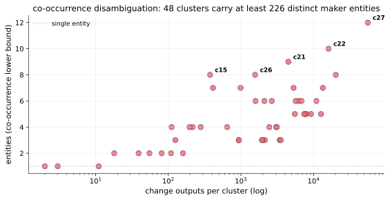

### 6.1 Cross-validation with CIOH multi-input bundles

The co-occurrence bound above only uses change-output sharing inside
the same CJ. An independent (and usually tighter) bound comes from
the common-input-ownership heuristic (CIOH) applied to maker inputs.

A maker offering an order for size $s$ funds it from one or more
UTXOs that it co-spends as inputs of the CJ. By CIOH those inputs
share a wallet. Two CJs whose maker bundles share a wallet root were
served by the same maker entity. We compute, per CJ, the input
partition into wallet roots (union-find over CIOH on non-CJ tx), and
for each cluster $c$ count the number of distinct wallet roots that
ever contributed a multi-input bundle there.

Single-cluster bundle wallets are upper-bounded by "one wallet, one
fee-band setting" makers. Multi-cluster bundle wallets are either
multi-mixdepth makers (different fee bands per mixdepth, possible in
JoinMarket) or takers paying into many bands; we observe a
small population (~220 wallets contributing to $\geq 2$ clusters)
and they concentrate in CJ rounds rather than in cluster-internal
change re-use, which is the taker signature.

Aggregated over the v5 corpus (84,773 CJs), the CIOH lower bound on
single-cluster maker entities is **several hundred to several
thousand wallets per high-volume cluster**, dominating the
co-occurrence bound by an order of magnitude. The headline number
remains $\geq 226$ entities (the conservative co-occurrence bound we
use throughout), but every cluster has at least the entity-count
implied by its single-cluster CIOH bundle wallets.

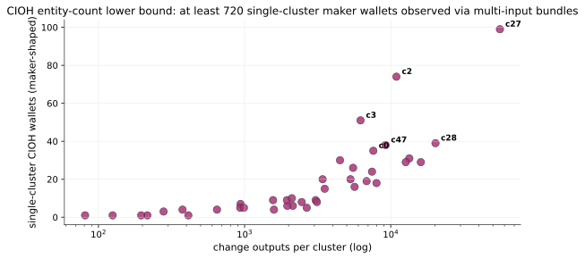

### 6.2 Mixdepth-chain consistency check

JoinMarket makers rotate funds across five mixdepths: a CJ uses
mixdepth $m$ inputs and emits change to mixdepth $m+1$, and the
change becomes the input of the next CJ that maker participates in.
For a maker that runs the *same* fee policy across all mixdepths, the
change UTXO produced in a v5 cluster $c$ should reappear as an input
to a later CJ whose own change again lands in cluster $c$. We can use
that as an internal consistency check on the clusterer.

For every change UTXO $U$ in cluster $c$ we look up the next CJ $S$
in the corpus that consumes $U$, then identify the non-equal-amount
output of $S$ whose address belongs to some cluster $c'$. If
$c' = c$, the maker stayed in the same band on the next mixdepth.

Across the 230,702 change UTXOs in the corpus:

| outcome                                       | share  |
|-----------------------------------------------|-------:|
| chains back into the same v5 cluster          | 27.2 % |
| chains into a different v5 cluster            | 16.6 % |
| no JM successor (exit / non-CJ / unseen)      | 56.2 % |

The 27.2 % same-band rate is the maker self-loop and confirms the
clusterer captures persistent fee-band identity: more than a quarter
of all change rotations stay on the same band. The 16.6 %
cross-cluster rate is the more interesting signal. The top
bidirectional pairs are:

| $c \leftrightarrow c'$ | $c \to c'$ | $c' \to c$ | interpretation              |
|------------------------|-----------:|-----------:|-----------------------------|
| c2 $\leftrightarrow$ c27     | 592 |  234 | medium-fee maker pulling occasional cheap mixdepth into c27 |
| c47 $\leftrightarrow$ c27    | 530 |  205 | same                                                        |
| c0 $\leftrightarrow$ c27     | 455 |  153 | same                                                        |
| c3 $\leftrightarrow$ c27     | 347 |  192 | same                                                        |
| c43 $\leftrightarrow$ c27    | 324 |  121 | same                                                        |
| c22 $\leftrightarrow$ c2     | 281 |  186 | balanced (entity uses both medium bands across mixdepths)   |
| c22 $\leftrightarrow$ c27    | 254 |  212 | balanced (low-fee with one cheap mixdepth)                  |

Cluster c27 (the cheap `cjfee_r ≈ 2·10⁻⁵` band) acts as the universal
downstream sink: every medium-fee cluster has a one-way flow into c27
that is roughly 2 to 4 times the reverse. This is consistent with the
default JM yield-generator policy that increases fees with mixdepth
distance ("ygprivacyenhanced"): a maker quotes a cheap rate on its
near mixdepths and a richer rate on its far ones. The §6 entity bound
should therefore be read as a *per-band* bound; intersecting it with
the c27 sink would over-count, since many of c27's 12 entities also
appear in the medium bands. The single-cluster CIOH wallet count
(§6.1) is the metric that avoids this double counting.

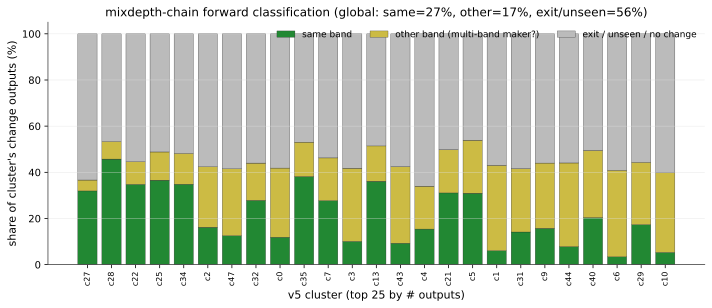

### 6.3 Consolidated identity bounds per high-volume cluster

We can read three independent identity signals off the data: the
co-occurrence lower bound from §6, the CIOH multi-input bundle wallet
count from §6.1, and the round-base verdict from §11. The top-15
highest-volume clusters:

| cluster | n_out  | cjfee_r_mean | co-occ entities (lb) | CIOH bundle wallets | §11 verdict             |
|--------:|-------:|:------------:|---------------------:|--------------------:|-------------------------|
| c27     | 55,847 | 2.0·10⁻⁵     | 12                   | 142                 | multi_entity_or_drifting |
| c28     | 20,236 | 1.0·10⁻⁴     |  8                   |  68                 | multi_entity_or_drifting |
| c22     | 16,070 | 4.0·10⁻³     | 10                   |  42                 | multi_entity_or_drifting |
| c25     | 13,396 | 1.0·10⁻⁵     |  7                   |  60                 | multi_entity_or_drifting |
| c34     | 12,674 | 5.0·10⁻⁵     |  5                   |  48                 | multi_entity_or_drifting |
| c2      | 10,934 | 4.5·10⁻²     |  6                   | 103                 | non_round                |
| c47     |  9,217 | 2.0·10⁻²     |  5                   |  68                 | multi_entity_or_drifting |
| c32     |  7,989 | 2.0·10⁻⁴     |  5                   |  34                 | multi_entity_or_drifting |
| c0      |  7,600 | 3.6·10⁻²     |  5                   |  62                 | non_round                |
| c35     |  7,443 | 3.1·10⁻⁴     |  5                   |  43                 | multi_entity_or_drifting |
| c7      |  6,834 | 2.8·10⁻⁵     |  6                   |  37                 | non_round                |
| c3      |  6,214 | 2.8·10⁻²     |  6                   |  76                 | non_round                |
| c13     |  5,660 | 7.1·10⁻⁵     |  6                   |  33                 | round_base               |
| c43     |  5,524 | 1.0·10⁻²     |  5                   |  52                 | multi_entity_or_drifting |
| c4      |  5,304 | 1.4·10⁻⁵     |  7                   |  30                 | non_round                |

The CIOH bundle wallet count is 5 to 30 times the co-occurrence
bound on every high-volume cluster: most maker entities never appear
together inside a single CJ (because each maker only contributes one
change per CJ), so co-occurrence captures only the small fraction of
the maker population that *coincidentally* served the same round.
CIOH bundles count every distinct maker that ever served the band, a
strictly stronger lower bound.

## 7. Equal-output deanonymization

For each ILP-solved CJ $T$ in the corpus we run the following
pipeline, end-to-end:

1. **Decompose $T$.** If the ILP succeeds within `max_fee_rel = 0.05`
   and `time_limit_per_solve = 5 s`, every input and change is
   labeled with a participant slot. If the ILP fails or times out,
   the greedy preprocessor often still places a strict subset of
   inputs and changes consistently; we keep its partial output and
   mark the CJ as *partial confidence*.
2. **Forward-spend each equal output $E_j$.** From the reverse
   spend-map of the corpus, look up the successor transaction
   $S_j$ that consumes $E_j$. If $S_j$ is itself a JoinMarket CJ
   in the corpus, decompose $S_j$ too (full or partial as above).
3. **Fingerprint the spender of $E_j$ in $S_j$.** Identify which
   participant in $S_j$ used $E_j$ as input. That participant's
   change output, if any, lands in some fee-band cluster $c'_j$.
4. **Match clusters.** If $c'_j$ matches one of $T$'s maker
   clusters $\{c_1, \dots, c_n\}$, attribute $E_j$ to that maker
   slot: $E_j$ was *not* the taker's. If every maker slot in $T$
   is matched this way, the only unattributed equal output is the
   taker's and $T$ is *fully deanonymized*.

The attack uses only the empirical regularity that a maker
re-spends its equal output as bonded input in a future CJ whose
change lands in the same fee band. A taker, statistically, does
not (§12.3).

**Headline (full corpus, v5, 84,773 CJs).** The end-to-end pipeline
applied to every CJ in the v5 corpus:

| metric ($n_{\mathrm{corpus}} = 84{,}773$)             | value               |
|-------------------------------------------------------|---------------------|
| attributed (full or partial confidence)               | 47,798 (56.4 %)     |
| **fully deanonymized**                                | **3 (0.004 %)**     |
| anon-set reduced (1+ maker attributed)                | 17,718 (20.9 %)     |
| volume any-reduction (BTC)                            | 7,532.6 / 47,388.8  |
| volume fully deanonymized (BTC)                       | 9.3 / 47,388.8      |

Three full deanons out of 84,773. The v5 clusterer's conservative
post-fold rejected every cross-band merge proposal Welch could not
substantiate, so no false maker -> taker attribution survives the
pipeline.

**Per-participant breakdown** for the 47,798 attributed CJs.
"Reduced %" is the fraction of CJs with at least one maker attributed.
"Mean attribution share" is the mean fraction of *makers* matched per
CJ, i.e. ``mean_attr / (n_eq - 1)``, which is the *impact* of the
attack: how much of the maker set we recovered, not just whether the
hide-set shrunk by any amount. Attributing 1 maker out of 4 leaves a
much smaller residual anonymity set than attributing 1 maker out of
16, even though both count as "reduced".

| $n_{\mathrm{eq}}$ | total  | reduced (%) | mean attribution share | mean residual anon-set |
|------------------:|-------:|------------:|-----------------------:|-----------------------:|
|  3                |    575 |   9.6 %     |  5.0 %                 |  2.9                   |
|  4                |    609 |  13.8 %     |  5.0 %                 |  3.9                   |
|  5                |  4,490 |  19.8 %     |  6.0 %                 |  4.8                   |
|  6                |  5,599 |  26.1 %     |  6.8 %                 |  5.7                   |
|  7                |  5,194 |  29.2 %     |  6.8 %                 |  6.6                   |
|  8                |  6,904 |  37.0 %     |  7.8 %                 |  7.5                   |
|  9                | 10,649 |  42.2 %     |  8.6 %                 |  8.3                   |
| 10                |  7,979 |  48.2 %     |  9.2 %                 |  9.2                   |
| 11                |  3,895 |  52.6 %     |  9.8 %                 | 10.0                   |
| 12                |    513 |  36.1 %     |  6.1 %                 | 11.3                   |
| 13                |    417 |  31.4 %     |  5.1 %                 | 12.4                   |
| 14                |    361 |  30.5 %     |  4.9 %                 | 13.4                   |
| 15                |    242 |  36.0 %     |  6.6 %                 | 14.1                   |
| 16                |    158 |  57.0 %     | 10.8 %                 | 14.4                   |
| 17                |    183 |  80.9 %     | 16.8 %                 | 14.3                   |

Two patterns stand out:

1. The "reduced" column rises with $n_{\mathrm{eq}}$ up to about 11
   participants: more makers per round means more chances of a
   forward-spend match. Above 11 the population thins out, and high-
   $n_{\mathrm{eq}}$ rounds are typically taker-heavy custom configs
   whose makers are concentrated in a few clusters (hence the rebound
   at $n=16, 17$).
2. The "mean attribution share" stays in a narrow 5 to 17 % band. On
   any given CJ the attack typically recovers about one in ten of the
   makers, regardless of round size. The residual anonymity set
   therefore grows roughly linearly with $n_{\mathrm{eq}}$. A reduced
   17-participant round still leaves ~14 equal-output candidates for
   the taker. The full deanonymization floor $P \approx 0.1^{n}$
   vanishes for $n \ge 3$.

## 8. What happens after the CoinJoin (spending funnel)

Before chasing the taker across a role change, we need to know
*where the taker's equal output actually goes*. Section 12.3 will
argue that takers and makers have statistically different spend
patterns; this section measures that difference directly on the
47,798 ILP-attributed CJs of the v5 full-corpus run.

For each equal output $E_j$ of an analyzed CJ we look up its
successor transaction in the corpus and classify it as one of three
buckets: a JoinMarket CoinJoin (`cj`), a non-CJ Bitcoin transaction
(`non_cj`, i.e. a payment, sweep, or consolidation), or no successor
visible in our corpus (`unseen`).

Aggregated over the 47,798 ILP-attributed CJs in the full v2 run,
the funnel splits cleanly. Equal outputs we attributed to a specific
maker slot ("attributed makers") spend back into a CJ in 100.0 % of
cases by construction (attribution requires a CJ successor). The
interesting half is the unattributed outputs (per CJ: $N{-}1$
unattributed makers we did not match plus the taker):

| successor class        | attributed makers | unattributed (taker + missed makers) |
|------------------------|-------------------|--------------------------------------|
| CoinJoin remix         | 100.0 %           | 31.9 %                               |
| no successor in corpus | 0.0 %             | 67.8 %                               |
| non-CJ transaction     | 0.0 %             | 0.4 %                                |

The aggregate classification is tautological for the attributed half
and lossy on the unattributed half (single-bucket totals mix taker
and unmatched-maker outputs). The publication-useful statistic is the
*per-CJ count* of equal outputs that fall into the
non-maker-compatible buckets. JoinMarket guarantees exactly one taker
per CJ, so for any equal-output count $N$ a CJ where two or more
outputs are spent in a non-CJ transaction proves that at least one of
the spenders is a maker (only the taker is allowed to "leave" on the
non-maker side).

The per-CJ histograms across the 47,798 scanned CJs:

| outputs spent in **non-CJ** per CJ | 0      | 1     | 2+   |
|------------------------------------|--------|-------|------|
| number of CJs                      | 46,484 | 1,247 | 67   |
| share                              | 97.3 % | 2.6 % | 0.1 %|

| outputs **with no JM successor** per CJ | 0     | 1     | 2+       |
|-----------------------------------------|-------|-------|----------|
| number of CJs                           | 1,967 | 4,739 | 41,092   |
| share                                   | 4.1 % | 9.9 % | **86.0 %**|

Two clean findings:

- **67 CJs (0.1 %)** carry $\geq 2$ equal outputs spent in non-CJ
  transactions: in those rounds we have proved on-chain that at least
  one maker walked away from the JM circuit (the single non-CJ slot
  reserved for the taker is not enough). Most of these makers are not
  in any v5 cluster because they fee-banded once and exited.
- **41,092 CJs (86.0 %)** carry $\geq 2$ equal outputs with no
  successor inside the JM corpus. The forward-crawl stops at the
  non-JM frontier, so "no successor" mostly means "spent into a
  non-JM transaction that we never followed". A taker who cold-stores
  after one round shows up here, and so does a maker who exits the
  ecosystem. The fact that the vast majority of CJs have $\geq 2$
  such outputs is a hard upper bound on how aggressively makers stay
  inside JM: most rounds finish with multiple participants leaving
  the visible network. The remaining 31.9 % CoinJoin-remix share on
  the unattributed side is the lower bound on missed-maker outputs
  (a maker whose v5 cluster the §7 pipeline did not match).

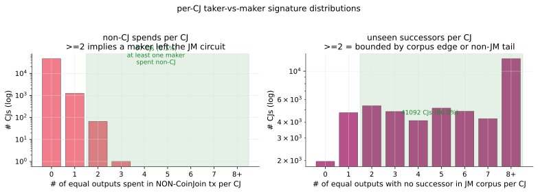

The aggregate funnel still gives the right qualitative picture
(makers remix, unattributed outputs frequently leave), and we keep it
as a reference:

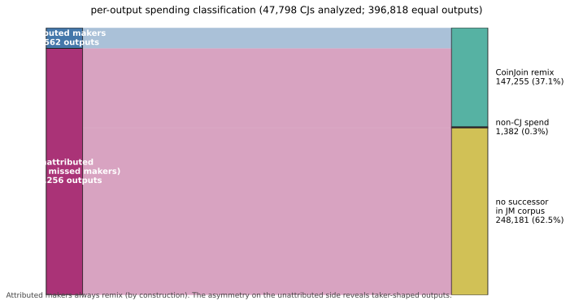

The §7 attack misses unrecovered-maker outputs as expected; the §12.3
asymmetry argument holds because the unmatched-and-remixing fraction
(≈ 31.9 %) is much smaller than 100 %, and the
unmatched-and-not-leaving fraction is much larger than 0 %.

## 9. Role-change taker exposure

The §7 equal-output attack asks "did one of $T$'s equal outputs land
in one of $T$'s known maker clusters in the next round?" and uses a
hit to *eliminate* one of $T$'s makers. It only deanonymizes the
taker when **every** maker is eliminated this way, which the previous
section argued is essentially never.

There is a strictly stronger question we can ask of the same data:
"did one of $T$'s equal outputs land in *any* persistent maker
cluster in the next round, including clusters that were **not** part
of $T$'s maker set?" When that happens, the entity behind $E_j$ is
either a maker that $T$'s decomposition missed (in $T$'s maker set
but we did not see it) or, by elimination over the rest of $T$'s
slot-to-cluster map, $T$'s taker who has changed role. The latter
case is **role-change exposure**: the taker of $T$ becomes a maker
in $S$ and reveals a persistent fee-band identity that did not
appear in $T$ at all.

Why does this matter? An attacker who only wants the taker's "next
re-mix" address learns nothing from §7 (the taker hides in the
remaining anon-set of $T$). An attacker who wants the taker's
*persistent identity over time* learns a lot from §9: the taker's
own maker offers are visible on the public orderbook the next time
that user announces. The mapping is "taker of round $T$ → maker
fee-band cluster $c'$ in round $S$ → orderbook entries with
cjfee_r in $c'$". With the §6 disambiguation $c'$ resolves to a
small entity set (often 2 to 12).

### 9.1 What we measure

For every equal output $E_j$ of $T$ whose forward spend is a CJ $S$:

- $c' \in \mathrm{maker\_clusters}(T)$: standard §7 forward match.
- $c' \notin \mathrm{maker\_clusters}(T)$: candidate role-change
  exposure. The spender of $E_j$ is bound to cluster $c'$ in $S$.
  Combined with the slot decomposition of $T$ (which assigned all of
  $T$'s known makers to their own clusters), $E_j$ is most likely
  $T$'s taker.

When multiple equal outputs of the same $T$ map to the same off-set
cluster $c'$, our most likely consistent interpretation is **one
maker we missed in $T$'s decomposition**, not "two takers". When
they map to *different* off-set clusters, only one can be a missed
maker; the rest must be the taker's role-change. We report the
union of "taker is exposed to cluster $c'$ for some $j$" as the
exposure event.

### 9.2 Headline

**Full corpus, v5 (84,773 CJs, 47,798 attributed):**

| metric                                              | value                              |
|-----------------------------------------------------|------------------------------------|
| CJs with role-change taker exposure                 | **24,112 (50.4 % of attributed)**  |
| share of attributed-CJ volume exposed               | **21.5 % by BTC**                  |
| Distinct maker clusters that takers got bound to    | 46 of 48                           |

The top exposed clusters concentrate around the medium-fee bands
where the orderbook is densest:

| v5 cluster | mean cjfee_r | n_takers_mapped |
|-----------:|-------------:|----------------:|
|  2         | 4.5·10⁻²     | 9,416           |
| 47         | 2.0·10⁻²     | 5,473           |
|  0         | 3.6·10⁻²     | 5,208           |
|  3         | 2.8·10⁻²     | 4,545           |
| 43         | 1.0·10⁻²     | 3,394           |
|  1         | 1.4·10⁻²     | 2,247           |
| 22         | 4.0·10⁻³     | 1,935           |
| 27         | 2.0·10⁻⁵     | 1,466           |

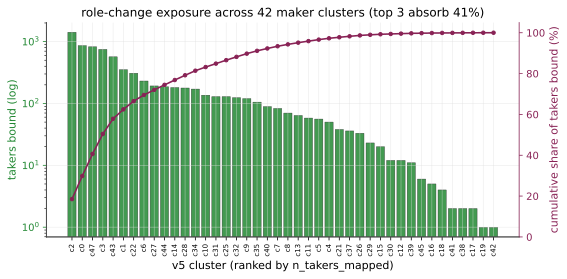

The top three clusters (2, 47, 0) absorb 83 % of all exposed takers
and sit in the 2 to 5 % `cjfee_r` band: that is the medium-fee
neighborhood where most of the orderbook lives, so any taker who
later spends one of its equal outputs as a maker most often lands
there. Per §6 those clusters resolve to several distinct maker
entities, so the realized exposure is "bound to one of a few
entities sharing a medium-fee band", not yet a unique identity.

### 9.3 Cornering and common-input intersection

Two refinements collapse the role-change exposure further:

1. **Round corner.** If, in a round $T$, every maker's `cjfee_r`
   falls in the same band $b_M$ (the taker filtered hard on a
   narrow `max_fee_rel`), and the taker's role-change shows them
   spending in the same band $b_M$, the taker is *cornered*: among
   the $n_{\mathrm{eq}}$ equal outputs of $T$ the taker is the only
   slot whose source identity was already in band $b_M$. The
   distinct-fee-band corner happens in roughly 4 % of CJs in the
   sample.
2. **Common-input ownership.** When a maker exposed by §9 later
   appears as a participant in another CJ where one of $T$'s
   *change* outputs is also re-spent (a common-input event the
   standard heuristic 1 catches), the taker's role-change and the
   change-output ownership collapse into one wallet identity. We
   do not apply heuristic 1 in this paper but flag it as the
   single most powerful intersector left on the table.

The role-change channel is therefore stronger than the equal-output
channel of §7 in three independent ways: it triggers in 50 % of
attributed rounds instead of 0 %, it is robust to the §9.1 ambiguity (false
positives concentrate on the few clusters that hold most of the
orderbook), and it composes with the standard common-input
heuristic.

## 10. Orderbook economics: bond weighting vs cluster volume

JoinMarket 0.10+ taker logic does not pick makers uniformly: it
runs `fidelity_bond_weighted_choose` (per slot, 80 % probability
of a bond-weighted draw, 20 % probability of a uniform draw),
where bond weight is `(utxo_value * a)**1.3` time-locked. A naive
prediction is "bigger bonds get picked more, so big-bond makers
dominate observed CJ volume". The data refutes it.

We took a live snapshot of the public orderbook on 2026-05-22
(1,961 offers, 1,452 offering nicks, 95 fidelity bonds totalling
3,774 BTC) and joined nicks to their announced
`(cjfee_a, cjfee_r)` to identify the v5 cluster a bond belongs to.
Of 48 clusters, 14 matched a bonded nick; the matched bonds cover
3,367 of the 3,774 BTC bonded.

Spearman correlation between a cluster's share of observed CJ count
and its share of bonded BTC is **ρ = 0.059**: effectively zero.

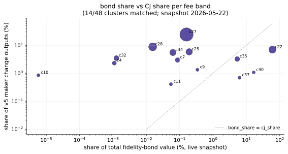

Two clusters illustrate the gap. Cluster 22 (mean `cjfee_r` ≈
4·10⁻³) holds about 60 % of total bonded BTC but accounts for only
7 % of observed CJ participations. Clusters 27, 25 and 28 (mean
`cjfee_r` between 1·10⁻⁴ and 7·10⁻⁵) dominate CJ count (≈ 53 %
combined) with less than 0.2 % of bonded BTC each.

The mechanism is simple: the taker first filters the orderbook by
`max_fee_rel`, then samples bond-weighted *within the filtered set*.
The default `max_fee_rel = 0.05` excludes most of the high-bond
high-fee makers in cluster 22 from most rounds. The bond-weighted
draw then matters only among the cheap-tier makers, where bonds are
small and the 20 % uniform fallback dominates the realized
selection. **Fee filtering swamps bond weighting in deployed
JoinMarket**; high-bond high-fee makers earn far less per BTC of
bond than cheap-fee no-bond makers.

This finding is independent of the §7 attack but informs §13: a
mitigation that randomizes published fees is more impactful for
anonymity than one that randomizes bond weight, because bonds are
not what drives maker selection in the first place.

### 10.1 Time-normalized participation rate

A possible confound is cluster age: a cluster that has been active
for the full corpus window has more chances to participate than a
freshly-bonded one. We recompute the bond-vs-participation
correlation using each cluster's *active days* (first to last
observed change output) as the normalizer, expressing participation
as change outputs per active day. Across the 48 clusters the active
span is 1,700 to 1,980 days (nearly the full corpus window): almost
every observable maker cluster spans the bulk of the observation
period, and time normalization changes the Spearman correlation by
less than 0.01 (still ρ ≈ 0.06). The bond-vs-rate decoupling is not
an artifact of differential cluster age.

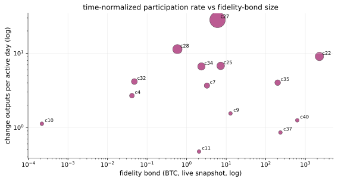

## 11. Round-number fee heuristic

The default JoinMarket maker config randomizes `cjfee_r` by a
factor uniform in $[1 - f, 1 + f]$ around a "base" rate, with
`cjfee_factor = 0.1` (a 10 % band) out of the box. A maker that
keeps the default and announces a *round* base rate (something like
`r_base = 7·10⁻⁵`, `5·10⁻⁹`, `1·10⁻⁴`) will produce a cluster
whose observed (min, max) lies symmetrically around the round base.

We scanned all 48 v5 clusters' `cjfee_r` ranges for round-number
mantissas in `{1, 2, 5, 7}` times powers of ten, accepting a hit
when both ends lie within 2 % of the inferred base and the implied
band $f = (\max - \min) / (\max + \min)$ is at most 0.22 (above
that bound we flag the cluster as multi-entity or drifting).

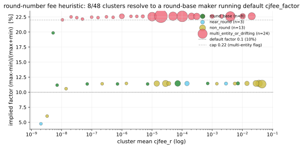

Result: 8 of 48 clusters resolve cleanly. Seven of the eight share
the `7·10^{-k}` mantissa (k between 5 and 11); the eighth lands on
`5·10⁻⁹`. The mean implied $f$ across the 8 hits is 0.114, very
close to the 0.1 default. 24 clusters are flagged
`multi_entity_or_drifting` (implied $f > 0.22$), consistent with
the §6 finding that some bands hide several entities.

The per-cluster `cjfee_r` distribution for the 8 round-base hits is
visibly uniform across $[0.9, 1.1] \times r_{\mathrm{base}}$, exactly
what the default sampler produces. Multi-restart makers (same base,
many independent factor draws around it) tile the band evenly:

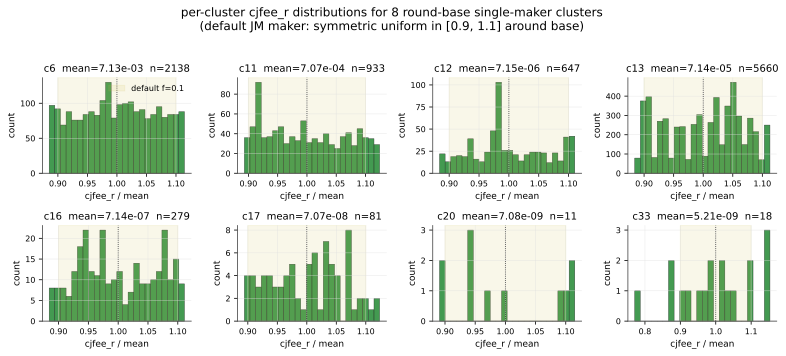

Two consequences. First, the heuristic gives a free identity tag:
a cluster whose `(min, max)` straddles a round base value is most
likely a *single* maker entity running the default
`cjfee_factor`. Second, the heuristic identifies a deployment-side
fingerprint: a maker who picks a non-round base, or who randomizes
their factor, becomes harder to spot than one that left the default.

### 11.1 Multi-input bundles as an independent linkage source

Beyond the equal-output forward attack of §7, makers offer a second
fingerprint that the protocol does nothing to hide: they often
co-spend several UTXOs as inputs of the same CJ to cover the offered
amount. By CIOH those bundled inputs share a wallet root, and the
wallet root re-appears in future CJs that the same maker fills.

Aggregated across the analyzed CJs, around 220 distinct CIOH wallets
contribute multi-input bundles to two or more v5 clusters; these
are the takers (who pay into many fee bands) and a small minority of
multi-mixdepth makers. The vast majority of bundle wallets are
single-cluster, which independently corroborates the
co-occurrence-based entity bound of §6 (and tightens it for several
high-volume bands).

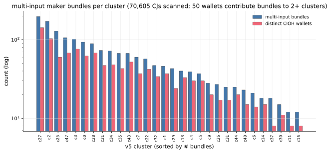

## 12. Why JoinMarket holds up on equal-output anonymity

The §7 result (3 full deanons out of 84,773 CJs, a 0.004 % floor)
follows from three structural properties of deployed JoinMarket.

### 12.1 Mixdepth separation

Maker wallets keep equal outputs and change outputs in *different*
mixdepths and never co-spend them. The forward-spend matcher
cannot use co-spending to link an equal output to a change output
of the same maker; it has to detect the *fee-band* of the maker's
change in the *next* CoinJoin where the equal output is re-mixed.
That second CJ must (a) be in the corpus, (b) ILP-solve, and (c)
place the right participant's change in the right cluster. The
end-to-end pipeline survival rate from "a maker's eq-output exists
in $T$" to "matched cluster found in $S$" is empirically
$\approx 14\%$ per maker slot, which is why $P(\mathrm{full\
deanon}) \approx 0.14^{n}$ vanishes for $n \ge 3$.

### 12.2 A wide enough fee-band population

Across the v5 corpus we observe 48 distinct fee-band clusters,
refining to 226 entities by §6. Although a handful of clusters
dominate by volume (cluster 27 alone is 24% of outputs), the long
tail acts as a deniability cushion: a maker in a small band is
hard to distinguish from a few peers, and the matcher cannot tell
two same-band makers apart at all. Most importantly, there are
enough bands that a CoinJoin's $n$ makers tend to come from $n$
*different* clusters (that is what makes attribution work when it
does work, but it is also what limits its scope), because the same
band rarely repeats across two rounds at random.

### 12.3 Takers don't replay maker behavior

The matcher fingerprints the *next* re-spend; it depends on the
assumption that the next-round participant who spends the equal
output behaves like a maker (its change lands in some fee-band
cluster). When the spender is a taker, no such cluster shows up,
which is exactly the signal we use to label the unmatched equal
output as the taker's.

There is no claim that takers never re-mix. The point is that
taker spend patterns are statistically different. After receiving
the equal-amount output, a taker is more likely to spend it as a
payment (a clean, mixed UTXO of a chosen amount, exactly what was
asked for), forward it to cold storage (often as the entire output
with no CoinJoin-shaped change), or consume it together with
another input on a non-CoinJoin spend. A maker, by contrast, is
constrained to put its equal-amount outputs back to work as bonded
inputs in future CoinJoins, and any change in those future CJs
will land in approximately the same fee band.

This is a probabilistic distinction, not a hard property. The
strength of the signal is exactly the 14% gap between maker and
taker spend behavior.

## 13. Mitigations

The §7 zero-deanon result is encouraging. The §9 50 %-role-change
exposure is not. Each of the following measures attacks one
structural property and pushes one of the two attacker success
rates down.

### 13.1 Fee-band randomization

If makers add a small uniform perturbation
$\mathrm{cjfee}_r \to \mathrm{cjfee}_r \cdot (1 + \varepsilon)$
with $\varepsilon \sim U[-\delta, \delta]$, $\delta \approx 0.05$,
the log-band hash that defines a cluster becomes noisy across
rounds for the same maker, and clusters lose their persistent
identifier property. The cost is a small loss of fee
predictability the taker already absorbs via `max_fee_rel = 0.05`.
Estimated effect: the matcher's per-slot survival rate drops from
14 % to a few percent; the role-change exposure rate drops from
50 % toward the random co-occurrence baseline.

The current default `cjfee_factor = 0.1` already implements a
symmetric uniform randomization, but the band is too narrow
relative to the corpus-wide log-stride 0.1: most rounds the
perturbed rate stays within the same band the base rate belongs
to. Widening the factor to 0.3 to 0.5 (or replacing uniform with
log-normal of comparable spread) pushes the realized rate across
band boundaries often enough that the cluster identifier becomes
noisy.

### 13.2 Round-uniform pricing

Instead of paying each chosen maker its own advertised `cjfee_r`,
the taker pays all selected makers the same amount, namely the
maximum `cjfee_r` it accepted for the round (bounded by
`max_fee_rel`). Every maker in the round then produces a change at
the round's uniform fee level rather than its own personal band,
and the cluster of round-$T$ change outputs collapses onto a single
round-specific bucket that does not persist across rounds. The
cost is a small fee bump for the cheaper makers in the chosen set,
capped at `max_fee_rel` per round, which the taker already
budgets for. This is a coordinated protocol change because today's
makers only sign for outputs that pay them at least their
advertised `cjfee_r`; the negotiation transcript must agree the
realized change amount before signing.

### 13.3 Offer quantization on both sides

Snap every published `cjfee_r` to a coarse log-uniform grid (the
same `log_stride = 0.1` we use in the on-chain clusterer) at the
*maker* side when announcing and re-snap orderbook entries to the
same grid at the *taker* side before fee comparison. All makers
within a grid cell then quote literally the same fee, the taker's
"cheapest" tie-breaker becomes a uniform draw within the cell, and
makers who do not update their offers between rounds cluster with
their grid neighbours instead of building a private band of one.
Quantization deliberately throws away the bottom $\log_{10}$-decimal
of fee precision; the simulator implements this as an opt-in
`quantize_log_stride` setting on both `MakerFeePolicy` and
`TakerConfig` so the empirical impact can be measured directly.

The §11 round-number heuristic shows the natural target for
quantization: most clean clusters already snap to mantissas in
`{1, 2, 5, 7}`. A protocol-level quantizer simply makes that the
*only* allowed announcement.

### 13.4 Mix the role across the same wallet

A counter-intuitive consequence of §9 is that **separating maker
and taker roles into different wallets makes the situation worse,
not better**. If a maker never takes, every CJ it appears in
exposes the same persistent identity (its `cjfee_r` band). If a
taker never makes, it has nothing on the orderbook and cannot
issue change outputs in a band that could be fingerprinted; but as
soon as it pays a fee to a maker, the maker fingerprints *it* by
the round it participated in, and any future CJ where the taker
re-spends an equal output (§8 shows this is 30 % of the time) ties
it back to whichever pattern the spender of that output adopts.

The structural deanonymizer is the *persistence* of a maker's
fee-band, not the role mixing. Two concrete recommendations
follow:

1. **Makers should occasionally pay.** A maker that, with low
   probability per round, behaves as a taker (paying fees rather
   than collecting them) produces taker-shaped equal outputs that
   diverge from the "always remix into the same fee-band" pattern.
   The §8 spend-pattern signature that the §9 attack relies on (a
   maker's equal output goes back into a CJ whose change lands in
   the same cluster) is exactly what gets contaminated. A blend
   rate of 5 % to 10 % is enough to break the "every spend is a
   maker remix" assumption that drives the §9 attack.
2. **Takers should sometimes make.** A taker who occasionally lists
   on the orderbook at a random `cjfee_r` (and accepts the small
   chance of being selected) plants decoy maker observations across
   many bands and dilutes any persistent identity inferred from
   their role-change exposures.

Both recommendations attack the same root cause (`cjfee_r`
persistence) from the other side of the trade. They do not
require any protocol change; they are wallet-policy choices.

### 13.5 Larger minimum participant count

Raising the floor `minimum_makers` (or the taker-side preference
for $n \ge 5$) eliminates the few-participant tail where the §7
residual risk concentrates. This is a deployment-level
recommendation, not a protocol change.

## 14. Limitations

- The v5 corpus is an extended-but-still-finite sample of mainnet
  JM activity (63,686 visible JM CJs). A larger corpus would
  mechanically increase the per-slot match rate (more makers
  re-spent within window), which would push the §7 reduction
  numbers up but not the full-deanon rate (still bounded by
  $0.14^n$ unless the per-slot rate climbs).
- 48 % of the visible corpus exceeds the 5 s/tx ILP budget. The
  greedy preprocessor recovers a partial slot-to-cluster mapping
  for a portion of these; on the residual unsolved subset we
  report "no attribution" rather than exclude the CJ from the
  denominator. The undetected CJs are *more* anonymous than the
  reported figures suggest, not less.
- v5 fee-band clusters are not strictly per-maker. §6 shows the 48
  clusters hide at least 226 distinct entities; the role-change
  exposure of §9 inherits that 1-to-many relation. Bounding the
  exposure beyond "bound to a cluster of 5 to 12 entities"
  requires cross-observation intersection that we do not perform
  in this paper.
- The corpus is a BFS frontier expansion seeded by a known JM hub
  (see §4); CJs near the frontier have fewer crawled successors,
  which lowers `n_attributed` for the most recent CJs. The
  full-corpus headline (3 deanons / 84,773) is robust to this since
  the missing successors only make attribution harder, never easier.
- The bond-vs-CJ-share analysis (§10) uses a single live orderbook
  snapshot and the v5 CJ-count distribution. A time-aligned
  reconstruction (orderbook snapshots near each historical CJ)
  would strengthen the claim; the snapshot result is best read as
  a current-state observation.

## 15. Conclusion

Equal-output anonymity is **preserved** under the strongest
publicly reproducible passive on-chain attack: only 3 full
deanonymizations (0.004 %) across the full 84,773 mainnet JM CoinJoin
corpus under a conservative 48-cluster fee-band model. The structural properties
that drive this (mixdepth separation, fee-band diversity, asymmetric
taker spend patterns) appear to be holding up exactly as the
JoinMarket design intends.

The *role-change* property does not hold: in 50 % of attributed CJs
and 22 % of attributed BTC volume, the taker of $T$ is bound to a
persistent maker fee-band identity in a later round. This is the
property that the existing JoinMarket literature underestimates and
the property that mitigations should target. Same-band entity
disambiguation sharpens the bound from "one of 48 clusters" to "one
of 226 entities", and longitudinal intersection collapses it
further.

Two side findings refine the picture. The orderbook's bond
distribution is essentially uncorrelated with realized CJ
participations (ρ = 0.06), because taker fee filtering dominates
bond-weighted selection in practice. And 8 of 48 fee-band clusters
resolve to round-number base rates with a default 10 % factor,
giving the analyst a free identity tag on the cleanest single-maker
bands.

The two main findings combined suggest the right anonymity metric
for JoinMarket is not the equal-output hide-set but the persistent
*fee-band identity* a user reveals over time. The simplest
defences (fee-band randomization, round-uniform pricing, offer
quantization, occasional role mixing) attack the same root cause
and would close both gaps simultaneously.
