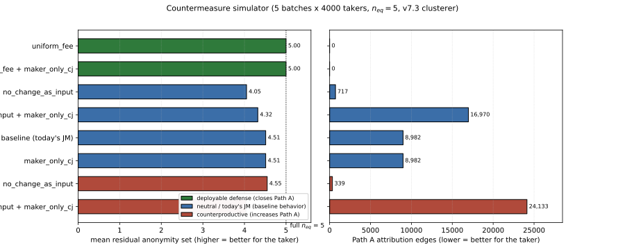
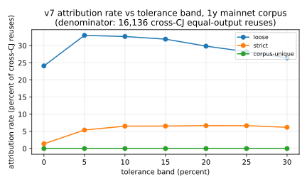
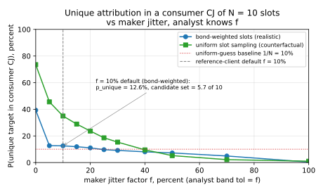

# JoinMarket Maker Wallet Clustering and Taker Anonymity-Set Reduction

> **TL;DR.** JoinMarket holds up well in practice. On one year
> of mainnet activity (10,581 CoinJoins), a passive observer
> using only on-chain data and the public offer feed trims the
> taker's average hide-set from 7.61 to 6.86 equal outputs per
> CoinJoin, a 9.8% reduction, and never wrongly merges two real
> wallets (precision = 1.0). Almost half of all CoinJoins (48.5%)
> leak no maker at all; only 0.22% collapse to the taker alone.
> The one signal that does most of the damage is the **fee
> fingerprint**: a maker's fee is a fixed function of its
> advertised offer, so when the same maker shows up in a later
> CoinJoin the fee it charges often points back to exactly which
> output it produced earlier. The practical fix is **taker-side
> fee quantization**: takers round every maker's fee in their
> round up to the nearest step on a small public grid (opt-out),
> so makers on nearby offers become indistinguishable. The
> asymptotic ideal is full fee homogenization (every maker on the
> same offer), which our simulator confirms drives the residual
> back to the full hide-set ([§9](#countermeasures)). The protocol
> is robust today and improvable.

## A two-CoinJoin example first

Before any of the machinery, here is the whole attack in two
transactions. This worked example is the clearest way into the
result; everything after it is detail.

A JoinMarket CoinJoin mixes coins from one *taker* (the person
paying for privacy) and several *makers* (liquidity providers who
earn a fee). Everyone contributes inputs and everyone gets back
one **equal output** of the same round amount, plus a **change
output** for the leftover. The taker's privacy comes from hiding
among the equal outputs: an observer sees N identical outputs and
cannot tell which one is the taker's.

Two facts about how the maker software moves coins drive the
attack:

1. A maker's **change output goes back to the same wallet bucket
   (mixdepth)** the inputs came from, so it tends to be reused as
   an input by that same maker later. Following that reuse links
   the maker's appearances across CoinJoins. (JoinMarket wallets
   keep funds in five buckets numbered 0-4.)
2. A maker's **fee is a deterministic function of its advertised
   offer**. A maker advertising "0.1% of the amount" always
   charges 0.1%; a maker advertising "800 sats flat" always
   charges 800 sats. The fee is paid out of the maker's own coins
   (it shows up as a slightly larger change output, not as a
   separate output), and the integer-precision arithmetic is
   recoverable from the transaction.

Now the example. Maker A advertises 0.1% of the amount. Maker B
advertises a flat 800 sats. They appear together in two
consecutive CoinJoins:

- **CoinJoin T**, round amount 1,000,000 sats. A charges
  `0.1% * 1,000,000 = 1,000 sats`; B charges its flat `800 sats`.
- **CoinJoin S**, round amount 1,500,000 sats. A would charge
  `0.1% * 1,500,000 = 1,500 sats`; B would still charge `800 sats`.

In CoinJoin T, an observer sees three identical 1,000,000-sat
equal outputs and cannot say which belongs to A and which to B.
The equal outputs are anonymous *by amount*.

But A's equal output later gets spent as an input of A's slot in
CoinJoin S (this is the natural reuse described above). The
observer can read A's realized fee in S: it is 1,500 sats. Only A
could have charged 1,500 sats at S's amount (B's policy gives 800
sats). So the observer concludes: *the slot in S that reused this
output is A, and therefore the equal output it spent in T was
A's*. One of T's anonymous outputs has been deanonymized, and the
taker's hide-set in T shrinks by one.

That is the fee fingerprint. It only works because A's fee and
B's fee come out **different at the consumer round's amount**. If
A and B advertised the *same* offer, both would charge the same
fee and the observer could not tell them apart. That is exactly
why the fix is to make fees collide on purpose
([§9](#countermeasures)).

The rest of this paper measures how often this fires on mainnet
(answer: 22.8% of cross-CoinJoin reuses, dropping the average
hide-set by ~0.75), proves the clustering never merges two real
wallets, and evaluates the fix in a simulator.

## Glossary

| term | plain meaning |
|------|---------------|
| taker | the user paying for a mix in a given round |
| maker | a liquidity provider who joins for a fee |
| equal output | one of the N identical-amount outputs of a CoinJoin; the taker hides among them |
| change output | a participant's leftover coins, returned to the same wallet bucket the inputs came from |
| slot | one participant's contribution to one CoinJoin (their inputs + one equal output + at most one change output) |
| mixdepth | one of the five wallet buckets (0-4) a JoinMarket wallet keeps funds in |
| offer / fee policy | a maker's advertised price: either relative (a % of the amount) or absolute (a flat sat amount) |
| fee fingerprint | the maker's realized fee, recoverable on-chain, used to tell which slot produced an output |
| anonymity set / hide-set | the number of equal outputs the taker is indistinguishable among (N per round) |
| residual | the hide-set that *survives* the attack (lower is worse for the user) |
| cluster | a set of slots the attack proves belong to the same maker wallet |
| ILP | the integer program we solve per CoinJoin to recover who contributed which inputs and change |
| precision = 1.0 | every link the attack makes is a certainty, never a guess |
| CIOH | common-input-ownership heuristic: inputs spent together usually share an owner |

## 1. What this paper studies

A JoinMarket CoinJoin has one taker and M makers; it produces
N = M + 1 equal outputs and up to N change outputs. The taker's
advertised privacy is that its equal output is one of N
indistinguishable candidates.

JoinMarket protects that hide-set in layered ways: everyone runs
the same wallet and keeps funds in five mixdepths; makers
advertise offers over a Tor directory-node overlay under
randomized session nicknames, usually backed by a fidelity bond
(a timelocked UTXO the maker proves it controls,
[BIP-0046](https://github.com/bitcoin/bips/blob/master/bip-0046.mediawiki));
and the taker's identity does not by itself reveal which equal
output it owns.

This paper asks what a *passive* observer can still learn from
public data alone, and answers three questions:

1. How many maker wallets can be clustered from on-chain data, at
   precision = 1.0?
2. By how much does that shrink the taker's per-round hide-set,
   once we restrict to evidence that can actually name an
   individual equal output (the fee fingerprint, plus a few
   co-spend cases)?
3. Are the clusters correct against independent ground truth (an
   active probing campaign that collected real maker
   wallet-to-nickname bindings)?

A clarification on the headline, since it is easy to misread: the
9.8% figure is an *average* reduction in the size of the hide-set,
not a claim that ~half of all CoinJoins are broken. About half of
CoinJoins (51.5%) leak *at least one* maker, which usually still
leaves the taker hidden among several others. Only 0.22% of
CoinJoins lose enough makers to expose the taker outright.

## 2. Threat model

A passive on-chain observer with:

- a snapshot of JoinMarket CoinJoins, found by crawling forward
  and backward from known addresses (covering mainnet through May
  2026; ~24k CoinJoins back to mid-2021, but heavily concentrated
  in the last ~14 months);
- the public maker offer feed. Makers publish offers to
  directory nodes, and anyone can run a watcher that records the
  current order book (one public snapshot is
  [joinmarket-ng.sgn.space/orderbook.json](https://joinmarket-ng.sgn.space/orderbook.json),
  but the data is not tied to any single host);
- the ability to solve a small integer program per CoinJoin
  (under 30 inputs);
- a few CPU-hours (the full corpus pass runs in under 15 minutes
  on 14 cores).

The observer does **not** join any CoinJoin and controls no
maker. We did run a small, good-faith probing campaign in late
April 2026 (three rounds, 72 maker nicknames) used only as a
ground-truth check ([§6.2](#active-probing-of-real-makers));
it contributes nothing to the clustering itself, and we publish
only per-nickname UTXO counts and collision outcomes, never the
underlying addresses or bond UTXOs.

## 3. The three protocol facts the attack uses

1. **One slot per participant.** Each taker/maker contributes
   exactly one slot. Its inputs all come from one mixdepth `d`;
   its equal output advances to mixdepth `d+1 (mod 5)`; its change
   stays in mixdepth `d`.

2. **Change is sticky (same mixdepth).** Because change returns to
   mixdepth `d`, it is eligible to be a future input of the *same
   maker* the next time that maker spends from `d`. When a later
   CoinJoin's slot is built from inputs that exactly include this
   change UTXO, the two slots are the same wallet by construction.
   This is the **change-chain** link.

3. **The equal output advances and gets reused.** The equal
   output lands in mixdepth `d+1`. Makers usually spend from
   whichever mixdepth holds the most coins, which after a round is
   often (not always) the one that just received the equal output.
   When the equal output is reused as an input later, that reuse is
   the **equal-chain** link, but on its own it cannot say *which*
   of the round's identical equal outputs was reused. The fee
   fingerprint ([§5.2](#v7-the-fee-fingerprint))
   is what resolves that ambiguity, as shown in the example above.

Two smaller facts: a maker's offer is either relative or absolute,
not both; and the maker's contribution to the miner fee is 0 in
the default policy and across the observed corpus.

The attack treats fact 1 as a **must-not-link** (two slots of the
same CoinJoin are never the same wallet), fact 2 as a
**must-link**, and fact 3 (via the fee fingerprint) as the only
signal that names an individual equal output. Fees are used *only*
locally, to pick one slot inside one CoinJoin, never to pool
makers globally by their advertised price. Because every link is a
protocol certainty, the clusterer can only ever *under*-cluster,
so **precision = 1.0 by construction**.

### 3.1 The example, in protocol terms

A two-maker CoinJoin at amount 1,000,000 sats, taker plus makers A
and B, each charging a 1,000-sat fee, miner fee 4,000 sats paid by
the taker:

```
inputs (total 4,480,000):
  taker:   2,400,000
  A:       1,050,000  (from A's mixdepth 1)
  B:         950,000 + 80,000  (from B's mixdepth 0)

outputs (total 4,476,000; miner fee = 4,000):
  equal: 1,000,000  x3  (taker, A, B, in unknown order)
  change(taker): 1,394,000
  change(A):        51,000  = 1,050,000 - 1,000,000 + 1,000 fee
  change(B):        31,000  = 1,030,000 - 1,000,000 + 1,000 fee
```

Each maker earns +1,000 sats (its fee shows up inside its change
output, not as a separate output, which is a common point of
confusion). The integer program tells us which inputs and which
change belong to each slot; it cannot tell which equal output is
whose. A's change (mixdepth 1) and B's change (mixdepth 0) will
each reappear as a future input, giving the change-chain link.
A's equal output advances to mixdepth 2, B's to mixdepth 1; when
one is reused later, the fee charged in that later round names its
producer, exactly as in the opening example.

In real JoinMarket, the `yg-privacyenhanced` maker script applies
a +/-10% jitter to its advertised fee, but only when it
*re-publishes* its offer. Re-publishing happens occasionally (for
instance when the maker's spendable balance shifts), not between
every pair of rounds, so two consecutive rounds by the same maker
often carry the *same* fee, which strengthens the fingerprint. The
base `yg-basic` applies no jitter at all. The jitter narrows but
does not eliminate the unique-match condition:
[Appendix B](#appendix-b-is-the-existing-fee-randomization-enough)
shows the default +/-10% still leaves the maker uniquely
identifiable in 12.6% of cases (vs a 10% random-guess baseline),
and defeating the fingerprint by jitter alone needs an
impractically wide range.

## 4. Mainnet corpus

One year of mainnet JoinMarket activity, block heights 894,697 to
947,358 (2025-05-01 to 2026-05-01):

| metric | count |
|--------|------:|
| JM CoinJoin txs in window | 10,581 |
| fully decoded by the integer program | 6,315 (59.7%) |
| not fully decoded at the chosen budget | 4,266 (40.3%) |
| of those, partial maker slots recovered ([§7.4](#partial-slot-recovery)) | 4,219 (98.9%) |
| undecodable (no slots at all) | 47 (0.4%) |
| maker slots, total | 68,718 |

A "full decode" means a unique slot-by-slot solution where every
slot's recovered fee is non-negative and the round's fee budget is
respected. When the full solve times out (2s budget) or is
ambiguous, a cheap greedy pass still recovers the slots that are
forced ([§7.4](#partial-slot-recovery)). CoinJoins that decode to
nothing contribute no links, which is conservative: it can only
*over*-report surviving anonymity.

The fee budget (max 0.5% relative, max 10,000 sats absolute)
matches the observed maker population (the order book's realized
maxima are 0.4% and 9,644 sats), tightly bounding the realistic
policy space. A looser budget would admit spurious decodes and
hide the fee fingerprint.

## 5. The clusterer

The clusterer takes the per-CoinJoin slot decomposition and merges
slots across CoinJoins using protocol-forced links only. It is a
union-find with must-link and must-not-link constraints. We
describe it in incremental versions; each one only *adds* links to
the previous one and preserves precision = 1.0.

| version | new link |
|---------|----------|
| v6 | within-CoinJoin must-not-link; change-chain must-link |
| v7 | fee-fingerprint equal-output attribution ([§5.2](#v7-the-fee-fingerprint)) |
| v7.1 | co-spend across change UTXOs in a non-CoinJoin tx (CIOH) |
| v7.2 | non-CoinJoin round-trip CIOH |
| v7.3 | fidelity-bond funding-tx CIOH |

Headline numbers use v7.3 (the strictest). Because every merge is
a protocol consequence, the clusterer never over-merges; it only
fails to find links when the relevant CoinJoin is missing from the
corpus. So precision is 1.0 and recall is bounded by how much of
the network the corpus captures.

### 5.1 Cluster sizes

The full pass over 68,718 slots produces:

| metric | v7.3 |
|--------|-----:|
| total clusters | 20,454 |
| singletons | 11,272 |
| non-trivial (size >= 2) | 9,182 |
| largest cluster | 388 slots |
| same-CoinJoin collisions (precision violations) | 0 |

The zero-collision row is the falsifiability check: two slots of
the same CoinJoin in one cluster would be a hard error. Every
version passes it.


The distribution is heavy-tailed but bounded (median non-trivial
cluster is 3, largest is 388). There is no giant cluster of
thousands of slots, which would signal over-merging.

### 5.2 v7: the fee fingerprint

A maker's realized fee is a fixed function of its offer and the
round amount `a`:

$$
\mathit{fee}(a) =
\begin{cases}
\mathit{cjfee}_a & \text{(absolute offer)} \\
\mathrm{round}(\mathit{cjfee}_r \cdot a) & \text{(relative offer)},
\end{cases}
$$

using banker's rounding to the satoshi, matching
JoinMarket-NG's `Decimal(cjfee) * Decimal(amount)` in
`jmcore/src/jmcore/bitcoin.py` (and the equivalent in
joinmarket-clientserver). The integer program recovers this fee
per slot.

The fee alone is not identifying (thousands of slots share a
policy). v7 uses it *locally*. When an equal output of producer
CoinJoin T is spent in a later CoinJoin S, the consumer slot's fee
`f_c` at amount `a_S` is read off. We then check T's own slots:
is there exactly one slot whose offer would produce `f_c` at
`a_S`? We test two interpretations (the consumer is absolute, or
relative, comparing in exact integer parts-per-million so no
floating-point error creeps in). This is exactly the A-vs-B test
from the opening example.

v7 has three gate strengths:

- **loose** (per-CoinJoin unique under absolute *or* relative):
  the original gate; an edge fires when exactly one slot matches
  and the two interpretations do not disagree. Headline numbers
  use this gate.
- **strict** (both interpretations agree on the same slot):
  rejects single-criterion coincidences.
- **corpus-unique**: the chosen slot's fingerprint must be unique
  across the *entire* corpus. This is what restores precision =
  1.0 in the adversarial-jitter simulator
  ([§6.1](#simulator-and-the-gate-hierarchy)); on the
  real corpus it returns *zero* edges, because real fee diversity
  is not high enough for any slot to be globally unique, so it is
  usable only as a precision filter on top of the loose gate.

On the full mainnet crawl (32,430 cross-CoinJoin equal-output
reuses) under the loose gate:

| disposition | count | share |
|-------------|------:|------:|
| edge added (unique under abs OR rel) | **7,361** | 22.7% |
| ambiguous (>= 2 slots match) | 2,714 | 8.4% |
| interpretations disagree (dropped) | 113 | 0.3% |
| no slot matches | 22,242 | 68.6% |


The large no-match share is mostly reuses whose producer CoinJoin
is missing or undecoded. The 113 conflicts are dropped on purpose:
dropping them is what keeps precision at 1.0. v7 inherits v6's
within-CoinJoin must-not-link, so none of these 7,361 merges can
sneak in a same-CoinJoin violation (verified: 0 collisions in
[§5.1](#cluster-sizes), 0 cross-nickname collisions in
[§6.2](#active-probing-of-real-makers)).

### 5.3 v7.1: co-spend (CIOH)

If a non-CoinJoin transaction spends two change UTXOs belonging to
different maker slots, those slots share an owner (common-input
ownership). To stay at precision 1.0 we require the spender to have
at most two outputs (a consolidation or simple send), excluding
batched multi-recipient spends. On mainnet: 44 qualifying
spenders, 95 cross-CoinJoin merges, 0 same-CoinJoin pairs.

### 5.4 v7.2: round-trip co-spend

Many remixes pass through one non-CoinJoin hop: a maker spends its
change, passes it through a two-output hop transaction, and one
output later funds a maker slot. v7.2 links producer to consumer
across such a hop. On mainnet: 70 qualifying hops, 103 merges.

### 5.5 v7.3: fidelity-bond funding

The offer feed publishes each maker's fidelity-bond UTXO in
cleartext. The bond itself is rarely spent, but the transaction
that *created* it is a normal spend whose inputs share the bond
owner's wallet (CIOH). v7.3 anchors slots to a known bond owner two
ways: backward (an input of the funding tx that is also a maker's
change belongs to that owner) and strict-forward (if the funding tx
has at most two outputs, the non-bond output is the owner's change;
if it later funds a slot, that slot is the owner's). Funding txs
that are themselves CoinJoins are skipped.

How are bonds funded? Of 95 bonds in a 2026-05-22 snapshot, 66
(69%) are funded entirely from inputs with no visible JoinMarket
history (cold storage, exchange withdrawals, fresh wallets), so
they leak nothing. The 17 mixed-funding bonds are the ones that
leak a same-wallet edge. On mainnet v7.3 adds only 9 merges. Its
value is qualitative: it shows the *public offer feed alone* widens
a precision-safe wallet boundary with no probing needed.

## 6. Ground-truth validation

We validate v6 through v7.3 against three independent ground-truth
sources a passive observer would not normally have.

### 6.1 Simulator and the gate hierarchy

The simulator runs the same pipeline on a synthetic network in two
regimes (every maker on the default offer; or makers drawing varied
offers with ~10% jitter) and three observation modes (full labels;
fee-fingerprint-only "blinded"; fingerprint-and-must-not-link-only
"torture"). The point is to separate two questions: is the per-round
test sound, and does the corpus carry enough fee diversity for
soundness to matter?

Findings:

- **Uniform regime: v7 never fires.** When every maker advertises
  the same offer, no slot is uniquely identifiable by fee, so v7
  collapses to v6 and the fee channel correctly goes silent. This
  is the counterfactual the fix relies on. Note that v6's
  change-chain still reconstructs operator-level wallets even with
  the fee channel disabled, so fee homogenization removes the
  worst signal but is *necessary, not sufficient*: it does not
  hide that two slots are the same wallet, only which equal output
  each produced. The user-facing hide-set reduction, however,
  comes entirely from the fee channel, which homogenization shuts.
- **Varied regime, loose gate:** under jitter, 2.9% of clusters
  pick up a precision violation (a jittered fee colliding with
  another maker's policy). The strict gate cuts this but does not
  eliminate it.
- **Corpus-unique gate eliminates violations entirely** at ~5%
  recall cost. In the torture regime it produces no edges, which
  is the correct behavior when fees carry no signal.

So: under realistic fee distributions all gates report zero
violations (the probe set confirms 0 cross-nickname collisions
across all gates); under adversarial jitter the per-round gate can
break while corpus-unique holds. Mainnet headlines use the loose
gate because the empirical violation rate is 0 and the recall gain
is real; an adversarial-jitter setting should prefer corpus-unique.
[Appendix A](#appendix-a-tolerant-fee-fingerprint-matching) covers a
tolerance band for the case where jitter *does* fire between rounds.

### 6.2 Active probing of real makers

In late April 2026 we probed the live order book in three rounds
(72 distinct nicknames that authenticated with a real PoDLE
commitment), recording the UTXOs each nickname offered. Two UTXOs
from the same nickname in one round are the **same mixdepth of the
same wallet**, because the same bond key authenticates both.

| metric | v6 | v7 through v7.3 |
|--------|---:|----------------:|
| nicknames probed | 72 | 72 |
| nicknames with >= 1 match | 16 | 35 |
| offered UTXOs found in a cluster | 19 | 40 |
| **cross-nickname collisions in any cluster** | **0** | **0** |


The pass/fail check: for every pair of distinct probed nicknames,
no cluster contains a UTXO from both. We observe **zero** such
collisions under all five versions. Every probed nickname whose
UTXOs appear in the clusters has all of them in clusters that
belong only to that nickname. The unmatched 37 nicknames simply
never entered an observed CoinJoin in our corpus; they are not
failures. Three independent precision checks (by construction,
the within-CoinJoin structural check, and this probing oracle) all
converge on precision = 1.0.

## 7. Anonymity-set reduction

For each decoded CoinJoin T the taker hides among N = M + 1 equal
outputs. The hide-set only shrinks when a *specific* equal output
is attributed to a specific maker. We call a producer slot
**certified** when one of two paths holds:

- **Path A (fee fingerprint).** Its equal output is reused in a
  later CoinJoin and the fee fingerprint
  ([§5.2](#v7-the-fee-fingerprint)) names it
  uniquely. This is the only edge that ties an equal output to a
  specific producer slot, and it is the mechanism in the opening
  example.
- **Path B (cluster co-spend).** A later slot spends the equal
  output alongside a change output from the same cluster, with no
  rival cluster anchored. A small downstream confirmation on top of
  Path A.

Just clustering slots together (change-chain, CIOH, bond-funding)
is **not** certification: it proves two slots share a wallet, but
does not say which equal output in T belongs to which slot.

The surviving hide-set for round T is
`k(T) = N(T) - (certified slots in T)`. The taker is never
certified (we have no chain evidence of who the taker is), so the
minimum is 1. The reported `k(T)` is a lower bound.

### 7.1 Headline

Across the 10,368 analyzed CoinJoins in the window (6,315 full
decodes + 4,053 with partial slots):

| metric | v6 (change-chain only) | v7 (Path A) | v7.3 (final) |
|--------|------:|------:|------:|
| mean published N | 7.61 | 7.61 | 7.61 |
| mean certified makers per CoinJoin | 0.01 | 0.75 | **0.75** |
| mean residual hide-set | 7.60 | 6.86 | **6.86** |
| share of CoinJoins with >= 1 certified maker | 1.4% | 51.5% | **51.5%** |
| median residual hide-set | 8 | 7 | 7 |
| share reaching residual = 1 (taker alone) | 0.0% | 0.22% | **0.22%** |
| Path A attribution edges | 0 | 7,474 | **7,474** |
| Path-B-only credits | 150 | 609 | **609** |


The change-chain (v6) clusters maker slots extensively but, on its
own, names almost no equal outputs. Adding the fee fingerprint (v7)
attributes 7,474 of the 32,801 cross-CoinJoin reuses in the window
(22.8%) and lifts the share of CoinJoins leaking a maker from 1.4%
to 51.5%. The mean hide-set drops 7.61 -> 6.86 (9.8%), and 23
CoinJoins (0.22%) collapse to the taker. v7.1-v7.3 add 152 more
cluster merges but no measurable hide-set movement: the cluster
graph supplies the *partition* (which slots are the same wallet);
the fee fingerprint supplies the *attribution* (which output came
from which slot). The fingerprint is where the user-facing damage
lives.

### 7.2 Per-round-size breakdown


The reduction holds across every round size from N = 3 to N = 17:
about one candidate lost on average, roughly constant in absolute
terms, so larger rounds keep proportionally more privacy.

### 7.3 What drives the surviving hide-set

Two structural sources: the true taker (always one, never
certified), and makers whose equal output is not uniquely
fingerprinted. Two things would shrink the residual further under
the same threat model: a larger crawl / bigger decode budget (more
reuses observable), and *greater* fee-policy diversity (each
distinct policy is shared by fewer makers, so a fee more often pins
one slot). Makers on the default policy are *less* attackable here,
because their fingerprint collides with every other default-policy
maker, which is precisely the property the fix generalizes.

### 7.4 Partial-slot recovery

For the 4,266 CoinJoins without a full decode, a greedy
preprocessing pass
(`joinmarket_analyzer.greedy.greedy_preprocessing`) locks in the
forced input-to-change pairings (where the fee equation admits
exactly one compatible change, and that change is compatible with
exactly one input). This recovers 21,621 partial slots from 4,219
CoinJoins (98.9%), sound whether or not a full solve would have
converged. Merging full + partial gives the headline 7.61 -> 6.86.
On full-decodes only the figures are 8.46 -> 8.12; partial CoinJoins
skew larger (the solver fails more on wide rounds), so they lower
mean N while adding attribution edges.

## 8. Role-change exposure (brief)

A taker who later acts as a maker can leak its cross-round identity:
if one of its equal outputs from T is reused by its later maker
slot and the fee fingerprint attributes it back, that producer slot
of T is identified as the taker. In the corpus this is a strict
subset of the 7,474 Path A edges and at most a few hundred
CoinJoins. We note it for completeness; the
[§7](#anonymity-set-reduction) reduction is the stronger result
because it applies to every CoinJoin regardless of role changes.

## 9. Countermeasures

The whole user-facing reduction rests on one load-bearing edge: the
fee fingerprint (Path A). The clustering edges (change-chain, CIOH,
bond-funding) group slots into wallets but cannot name an
individual equal output. Close Path A and the residual returns to
the full hide-set minus a small Path B contribution.

The deployable fix is **taker-side fee quantization**. A taker can
round every maker's fee in its round *up* to the nearest step on a
small, public grid (an opt-out default in the taker client). Makers
whose offers fall in the same grid cell then receive the same
realized fee in that round and become indistinguishable, collapsing
the within-round fingerprint without requiring any maker to change
its advertised offer. This is enforceable by the taker alone (the
taker sets the realized fees, subject to each maker's advertised
minimum), and it is the practical, incrementally-deployable form of
the defense.

The asymptotic ideal is **full fee homogenization**: if every maker
advertised the same offer, the fingerprint would never disambiguate
anyone. Quantization approximates this within each round; full
homogenization achieves it network-wide. The simulator below
measures the homogenization limit directly (it is the cleanest knob
to model), and quantization to a fine grid converges to the same
result as the grid coarsens.

One subtlety: quantizing only your *own* round is not a complete
unilateral fix. The same makers also serve other takers' rounds
under their actual offers, and the fingerprint can be reconstructed
from those rounds. The closer the grid is to a single
network-wide cell (i.e. the closer to full homogenization), the
less any single round leaks.

### 9.1 What an observer actually sees, ranked

1. **Fee fingerprint (Path A).** The only edge that labels an equal
   output. Suppressing it alone moves the residual to the full
   hide-set ([§9.3](#simulator-evaluation)). 7,474 of
   the 8,083 certifications in the corpus (92.5%) come from here.
2. **Cluster co-spend (Path B).** Only 609 extra certifications.
3. **Change reuse (v6).** Clusters slots; contributes only the
   indirect Path B credits. Structurally unavoidable as JoinMarket
   is deployed.
4. **CIOH and bond-funding (v7.1-v7.3).** Widen wallet boundaries;
   0 additional credits in practice on this corpus.

### 9.2 What does not work, and why

- **Consolidating change before the next round.** Collapses your
  own UTXOs into one cluster, which is the attack's premise; does
  not touch Path A.
- **Refusing to spend change as a CoinJoin input.** Closes the v6
  edge and some Path B but *not* Path A, and is counterproductive:
  it forces makers to spend equal outputs more aggressively,
  *increasing* the Path A surface (the simulator's
  `no_change_as_input` + `maker_only_cj` variant lands at residual
  4.04, worse than the 4.51 baseline, with 24,133 Path A edges vs
  8,982).
- **Using a JoinMarket-disjoint bond wallet.** 66 of 95 bonds
  already do; it closes the bond-funding edge but the bond is still
  published alongside the maker's offer, so the observer still ties
  it to the nickname and to every slot Path A attributes. Useful
  only combined with anonymous bond advertisement *and* fee
  flattening.
- **Batching non-CoinJoin spends into >= 3 outputs.** Defeats the
  specific CIOH heuristics here but the underlying inference
  survives an adapted heuristic; it raises the observer's cost, not
  the channel's existence.
- **Running over Tor.** Already standard and correct hygiene, but
  the entire attack runs on public chain data, so no network-level
  measure affects it.

### 9.3 Simulator evaluation

We enumerate the 8 configurations over three knobs: `uniform_fee`
(every maker on the default offer, the homogenization limit),
`no_change_as_input`, and `maker_only_cj` (a periodic synthetic
CoinJoin recycling held-back change). 150 seed makers, 5 batches of
4,000 takers, 10% churn, 5 makers per round, the wide mainnet fee
grid. Precision is 1.0 in every variant.

| variant | N | certified | residual | share res=1 | share any cert | Path A | Path B |
|---------|--:|----------:|---------:|------------:|---------------:|-------:|-------:|
| `uniform_fee` | 5.00 | 0.00 | **5.00** | 0.00% | 0.00% | 0 | 0 |
| `uniform_fee` + `maker_only_cj` | 5.00 | 0.00 | **5.00** | 0.00% | 0.00% | 0 | 0 |
| `uniform_fee` + `no_change_as_input` | 5.00 | 0.95 | 4.05 | 0.66% | 65.43% | 717 | 0 |
| `uniform_fee` + both | 5.00 | 0.68 | 4.32 | 0.36% | 45.99% | 16,970 | 0 |
| baseline (today's JM) | 5.00 | 0.49 | 4.51 | 0.03% | 38.35% | 8,982 | 794 |
| `maker_only_cj` | 5.00 | 0.49 | 4.51 | 0.03% | 38.35% | 8,982 | 794 |
| `no_change_as_input` | 5.00 | 0.45 | 4.55 | 0.13% | 34.09% | 339 | 0 |
| `no_change_as_input` + `maker_only_cj` | 5.00 | 0.96 | **4.04** | 0.82% | 59.98% | 24,133 | 0 |



Observations:

1. **Fee flattening is the only effective defense.** `uniform_fee`
   (the homogenization limit, which taker-side quantization
   approximates) is the only knob that drives the residual to the
   full hide-set with zero Path A attributions. Pairing it with
   `maker_only_cj` does not change that.
2. **`no_change_as_input` is counterproductive**, as above: it
   removes a clustering edge without touching the fingerprint and
   forces more equal-output spending.
3. **`uniform_fee` + `no_change_as_input`** is also
   counterproductive: a few residual fee differences (different
   slot amounts) interact badly with aggressive equal-output
   spending. The clean defense is fee flattening *alone*.
4. **Throughput is preserved** under `uniform_fee`; the
   throughput-risky knob is `no_change_as_input` (makers run out of
   spendable change).

Three defensible deployment positions:

- **Today:** residual 4.51 in simulator, 6.86 on mainnet; 0.22% of
  mainnet CoinJoins reach residual 1.
- **Taker-side fee quantization (recommended, opt-out default):**
  pushes the residual toward the full hide-set as the grid
  tightens, deployable by takers without maker cooperation.
- **Network-wide fee homogenization:** the limit case; reaches the
  full hide-set with zero Path A, but needs broad adoption.

Caveats: the simulator does not model non-CoinJoin maker spends (so
the CIOH/bond edges cannot fire) or an adaptive order-book-probing
adversary; on mainnet those edges add no Path B credits, so the
*relative ordering* across countermeasures still matches the live
attack.

## 10. Limitations

A finite crawl and a 2s decode budget (40.3% of CoinJoins not fully
decoded, though [§7.4](#partial-slot-recovery) recovers slots from
98.9% of them); the per-round gate admits a small fraction of false
edges under adversarial jitter (fixed by the corpus-unique gate at
~5% recall cost); the CIOH edges abstain on >= 3-output spends;
recent CoinJoins near the crawl horizon look more singleton than
they are, biasing the residual slightly upward for the last quarter.
None of these change the conclusion: the reduction is bounded, the
clusterer never over-merges on this corpus, and the fee fingerprint
drives the attack.

## 11. Conclusion

JoinMarket's per-round hide-set is largely realized in practice.
Against a passive observer running a precision-1.0 clusterer, the
published mean of 7.61 contracts only to 6.86 (a 9.8% reduction
over 10,368 CoinJoins). Almost half of all CoinJoins lose no
candidate; 0.22% collapse to the taker. The structural channel that
does the work is the fee fingerprint: a maker's fee is a fixed
function of its offer, so a reused equal output's later fee names
its producer. It has a known mitigation, taker-side fee
quantization (with full fee homogenization as the limit), that is
deployable as an opt-out client default and reaches the full
hide-set as the fee grid tightens.

Precision = 1.0 is what makes this actionable: every certified
maker is a *deterministic* hide-set reduction, validated three ways.
Behavioral half-measures (`no_change_as_input`, `maker_only_cj`) are
at best neutral and at worst counterproductive, because they touch
the clustering edges without touching the fingerprint. JoinMarket is
robust today and hardenable by a coordinated client-default change
that flattens realized maker fees, with no protocol-level
cryptographic addition required.

## Appendix A. Tolerant fee-fingerprint matching

The v7 gate uses exact integer equality. The reference clientserver
supports +/-10% per-announcement jitter (`cjfee_factor`), but only
in `yg-privacyenhanced` (the base `yg-basic` ignores it) and only
when the maker re-publishes its offer (an event triggered by an
unrelated balance shift, restart, or schedule), so it is *not*
guaranteed between two consecutive rounds. The newer jm-ng enables
jitter by default, but it is recent and our corpus is dominated by
clientserver-era CoinJoins. An opt-in tolerance band `t` (default 0)
lets the observer recover same-maker matches that exact equality
misses when jitter does fire.



On the corpus, the loose-gate edge count peaks at t = 0.05 (33% of
reuses, vs 24% at t = 0) then declines as wider bands induce more
per-round ambiguity. The strict gate gains a ~5x recall lift (1.4%
to ~6.7% at t in [0.15, 0.20]). The corpus-unique gate returns zero
edges at any tolerance (no slot is globally unique), so it works
only as a precision filter on the loose gate. Default t = 0 is the
right operating point for the loose gate.

## Appendix B. Is the existing fee randomization enough?

The real question is not "can the observer place a maker among all
order-book offers?" but "knowing the maker's fee in producer
CoinJoin T, can the observer pick its slot out of the N slots of the
consumer CoinJoin S?". The competitive set has size N, not the whole
order book, because only S's few slots ever compete with the target.

We simulate this directly: round amounts from the empirical 1y
distribution, N = 10 slots of S sampled from the live order book
(65 bonded relative offers, 41 distinct policies), under both
bond-weighted sampling (realistic) and uniform sampling. Each
realized fee carries jitter `j` uniform in `[1-f, 1+f]`.



At `f = 0` the target is uniquely identified in 39% of CoinJoins
under bond-weighted sampling (74% under uniform). The gap is the
whole story: 94.5% of the bond weight sits in 10 makers, and 5 of
those advertise policies near 0.4% within a 1.22x ratio, so the
draw often picks several effectively-identical makers and the
observer cannot disambiguate them even *without* jitter. This is the
same quantization effect the fix generalizes.

At the default `f = 0.10`, unique attribution drops to 12.6%
(vs a 10% random-guess baseline); the observer's expected candidate
set in S is 5.7 of 10. Bringing it below random-guess needs
`f >= 0.25` (bond-weighted) or `f >= 0.40` (uniform); reducing it to
~0.4% needs `f >= 1.0`, where the jitter's lower edge touches zero.
The lesson: the property that already weakens the fingerprint is fee
clustering among high-bond makers; the +/-10% jitter rides on top of
it rather than providing it. Extending that clustering to all makers
(via quantization, or in the limit homogenization) removes the
fingerprint as a deanonymization primitive. Fee randomization alone
is not sufficient.
