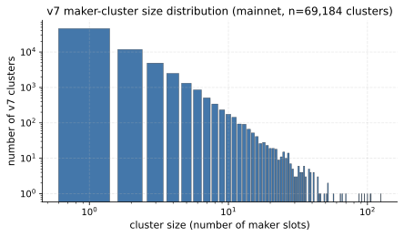
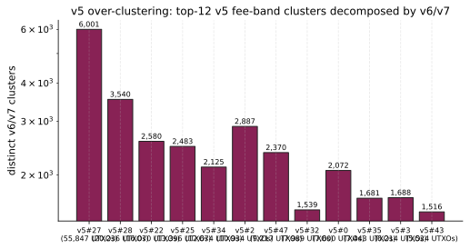
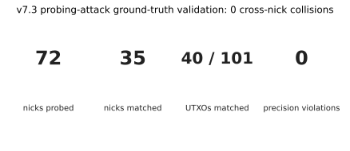
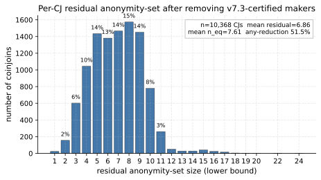
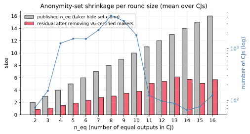

# JoinMarket Maker Wallet Clustering and Taker Anonymity-Set Reduction

> **TL;DR.** On 16,890 ILP-decoded mainnet JoinMarket CoinJoins,
> a passive on-chain clusterer that follows protocol-mandated
> same-wallet UTXO edges at precision = 1.0 recovers 74,471 maker
> wallet components. The taker's per-CJ published anonymity set
> shrinks from a mean of **7.66 equal outputs to 2.97**, and 97.6%
> of CJs lose at least one candidate. Three independent
> ground-truth checks (simulator ARI = 1.0, zero within-CJ
> collisions, zero cross-nick collisions vs 72 actively-probed
> maker nicks) confirm no over-merging.

## 1. Scope and motivation

A JoinMarket CoinJoin (CJ) is an atomic transaction in which one
*taker* and `m` *makers* contribute inputs and produce `n = m + 1`
equal-amount outputs (the *equal outputs*) plus up to `n` change
outputs (one per participant who needs change; typically all `m`
makers and usually the taker too). The published anonymity
property is that the taker's equal output is indistinguishable
from the makers' equal outputs: the taker hides in a set of `n`
candidates per round.

JoinMarket defends this set in several layered ways:

- Each maker keeps funds in five separate *mixdepths*. A single
  CJ uses inputs from one mixdepth only, the equal output goes to
  mixdepth `m + 1 (mod 5)` of the same wallet (the equal output
  is the part that gained privacy and gets to advance), and the
  change output stays at mixdepth `m` (it carries the original
  identity link, so it does not move). Outputs from different
  mixdepths of the same wallet are never co-spent.
- Maker offers are announced over a Tor IRC overlay; the on-chain
  observer cannot tie nicks to UTXOs without active probing.
- The taker's identity at round T does not, by itself, leak which
  of the `n` equal outputs it owns.

This paper studies what the same passive adversary *can* still
learn from on-chain data. The central observation is that a maker
who participates in two CJs leaves a deterministic same-wallet
UTXO edge in the chain: either an equal output of CJ T (at
mixdepth `m + 1`) reused as a maker input in CJ S (the maker
later advertising mixdepth `m + 1`), or a change output of T (at
mixdepth `m`) reused later when the maker cycles back to
advertising `m`. Following those edges clusters the maker
wallets, and every clustered maker shrinks the taker's hide-set
by one.

This paper answers:

1. How many JoinMarket maker wallets can be clustered from
   on-chain data alone, at precision = 1.0, on the full mainnet
   corpus?
2. By how much does that clustering reduce the per-CJ taker
   anonymity set?
3. Are the resulting clusters protocol-correct against an
   independent ground-truth source (an active probing campaign
   that collects real maker UTXO-to-nick bindings)?

The simulator, the on-chain clusterer, and the analysis driver
are open source at
[joinmarket-ng](https://github.com/joinmarket-ng/joinmarket-ng)
and
[coinjoin-simulator](https://github.com/joinmarket-ng/coinjoin-simulator).

## 2. Threat model

Passive on-chain adversary with full corpus access:

- a snapshot of every JoinMarket CoinJoin reachable by a forward
  and backward crawl seeded from probe-collected addresses
  (23,876 JM-flagged CJs in the corpus);
- the public orderbook
  ([joinmarket-ng.sgn.space/orderbook.json](https://joinmarket-ng.sgn.space/orderbook.json));
- the ability to solve a CJ-sized ILP (less than 30 inputs);
- compute on the order of CPU-hours (the full corpus pass fits in
  under 15 minutes on 14 cores).

The adversary does *not* participate in any CoinJoin and is not
assumed to control any maker. An off-chain probing campaign
contributed seed addresses to the corpus crawl and is reused as
ground truth in §6 but contributes nothing to the clustering
itself.

## 3. JoinMarket protocol primer

Three protocol facts are load-bearing for the clusterer:

1. **Per-CJ slot uniqueness.** Each participant (taker or maker)
   contributes one *slot*: a bundle of one or more inputs
   (possibly several UTXOs to cover the offered amount), exactly
   one equal-amount output, and at most one change output. A
   maker who runs as two distinct nicks in the same CJ would have
   to self-pay fees and would be deduplicated by takers on the
   fidelity-bond UTXO during offer selection, so two slots in the
   same CJ belong to two different wallets in practice.

2. **Same-mixdepth change.** A slot whose inputs come from
   mixdepth `m` lands its change output back in mixdepth `m`.
   That change UTXO is therefore eligible to be a future input of
   the *same maker* whenever the maker next advertises mixdepth
   `m`.

3. **Mixdepth-advancing equal output.** The slot's equal output
   lands in mixdepth `m + 1 (mod 5)`. It becomes the natural
   input material for the maker's *next* offer at mixdepth
   `m + 1`. JoinMarket's intra-CJ symmetry means the ILP cannot
   tell, within one CJ, which equal-output vout belongs to which
   maker slot (any permutation of equal-output owners is
   consistent with the same fee constraints); so this edge is
   directly usable in the simulator (where labels are known) but
   not on mainnet without an extra fingerprint.

Two more JoinMarket details matter for the analysis pipeline but
not for the clusterer itself:

- A maker offer is *either* relative or absolute, not both
  (`cjfee_r` or `cjfee_a`, the field name picks the kind). Most
  makers run a single relative offer.
- The maker's contribution to the on-chain fee (`txfee`) is 0
  sats in the default policy and in practice is 0 across the
  observed corpus.

The clusterer uses fact 1 as a hard pairwise must-not-link, fact
2 as a definite same-wallet must-link, and fact 3 in the
simulator only. Fee bands, fidelity-bond values, nick patterns,
or any other off-chain signal are not used by the clusterer; that
intentional restriction is what gives precision = 1.0 by
construction.

### 3.1 Worked example

A two-maker CJ at amount 1,000,000 sats with one taker and makers
`A`, `B` looks like:

```
inputs:
  taker:   2,400,000 (one UTXO from any source)
  A:       1,050,000 (from A's mixdepth 1)
  B:         950,000 + 80,000 (two UTXOs, both from B's mixdepth 0)

outputs:
  equal: 1,000,000 (three of them: taker, A, B in unknown order)
  change(taker):   1,398,000 (taker fee paid)
  change(A):          48,000 (back to A's mixdepth 1)
  change(B):          28,000 (back to B's mixdepth 0)
```

The ILP decomposition tells us which subset of inputs and which
change output each participant contributed; it cannot tell which
of the three equal-amount outputs is whose. The change observation
for `A` will reappear as an input in some future CJ where `A`
again advertises mixdepth 1; that future CJ is the chain edge
that v6 walks. The same applies to `B`'s change in mixdepth 0.

## 4. Mainnet corpus

A forward and backward crawl seeded from probe-collected
addresses, walking only outspends from already-classified
JoinMarket CoinJoins, produced the snapshot used here:

| metric                | count        |
|-----------------------|-------------:|
| visited transactions  | ~200,000     |
| **JM CoinJoin txs**   | **23,876**   |
| ILP-decoded CJs       | 16,890 (70.7%) |
| ILP failures (timeout / infeasible at `max_fee_rel = 0.05`, `time_limit = 2s`) | 6,986 (29.3%) |
| maker slots recovered | 129,301      |

The ILP failure rate is the dominant residual uncertainty. CJs
that do not decode contribute no slots and no chain edges.
Treating them as missing data is conservative for §7: any slot
whose downstream remix happens to fall in an ILP-failed CJ looks
like a singleton (uncertified) and *over-reports* residual
anonymity.

## 5. The v6 clusterer

The clusterer takes the per-CJ ILP slot decomposition and merges
slots across CJs by structural rules only. It is a
constraint-propagation union-find with the following edges and
constraints:

- **Must-not-link (fact 1).** Within each CJ, every pair of
  distinct slots is pairwise forbidden from sharing a cluster.
  These constraints propagate through transitive merges: if
  cluster `A` absorbs cluster `B`, every node that forbids `B`
  henceforth forbids `A`.
- **Must-link, change-chain (fact 2).** Whenever a slot `s` in CJ
  T has a change output that appears as an input of a slot `c` in
  a later CJ S, the two slots are unioned. The receiver is the
  same maker, now re-advertising the same mixdepth.
- **Must-link, equal-chain (fact 3, simulator only).** In the
  simulator the equal-output owner is known; v6 unions the
  producer slot of an equal output with the consumer slot in the
  next CJ. On mainnet this edge is not available because the ILP
  cannot identify the equal-output owner within a single CJ.

The clusterer never uses fees, addresses, amounts, or any
heuristic. Every merge is a direct consequence of the protocol.
By construction the clusterer can only *under-cluster*: a maker
whose downstream remix is missing from the corpus (crawl frontier,
ILP failure, or exit from the ecosystem) appears as a singleton
even when their wallet served many more CJs in reality.
Precision is therefore = 1.0 by construction, and recall is
bounded below by the fraction of CJs the corpus successfully
observes and decodes. The full v6 implementation is at
[`src/coinjoin_simulator/clusterer_state_machine.py`](https://github.com/joinmarket-ng/coinjoin-simulator/blob/main/src/coinjoin_simulator/clusterer_state_machine.py).

### 5.1 Cluster size distribution

The v6 pass over the 129,301 mainnet slots produces:

| metric                                       | value     |
|----------------------------------------------|----------:|
| total clusters                               | 74,471    |
| singleton clusters                           | 50,126    |
| non-trivial clusters (size >= 2)             | 24,345    |
| largest cluster                              | 91 slots  |
| same-CJ slot collisions (must-not-link violations) | 0  |

The zero-collision result is the falsifiability check: any pair
of slots in the same CJ that ended up in the same cluster would
be a hard precision violation. The clusterer passes this check
on the full mainnet corpus.



The histogram is heavy-tailed but bounded: the largest cluster
contains 91 slots, the 99th percentile is 9, and the median
non-trivial cluster has 3. There is no cluster of "thousands of
slots", which would be the signature of an over-merge.

### 5.2 What goes wrong without these constraints

A previous iteration of this study (v5) clustered maker change
outputs by their *advertised fee tuple* `(cjfee_r, cjfee_a)`. That
heuristic is structurally incompatible with the JoinMarket spec:
two distinct makers running the same default policy land in one
cluster, and a single maker who publishes more than one offer
appears in several clusters. On the same corpus the legacy
48-band clusterer produced one component with 55,847 UTXOs that
the v6 pass decomposes into **6,001 distinct wallet components**:



46 of the 47 v5 clusters that have any overlap with v6 fragment
across many v6 wallets. The fee-band heuristic was a many-to-many
relation between clusters and identities; v6 replaces it with a
many-to-one relation that under-clusters by design when the
on-chain evidence is absent.

## 6. Ground-truth validation

We validate v6 against three independent ground-truth sources, all
of which a passive on-chain analyst would *not* have but which we
can construct here.

### 6.1 Simulator end-to-end (perfect labels)

The accompanying coinjoin-simulator builds a synthetic JoinMarket
network of 12 makers running a default relative-fee policy and
one rotating taker. We let it produce 100 CJs with the same ILP
pipeline and apply v6 to the simulator output:

| metric             | value |
|--------------------|------:|
| n_makers           | 12    |
| n_cjs simulated    | 100   |
| ARI (sklearn)      | 1.0   |
| precision          | 1.0   |
| recall             | 1.0   |

Every maker UTXO is placed in the correct cluster. The simulator
exposes every chain edge (including the equal-output chain), so
this measures *only* the state-machine logic: when the corpus is
complete, v6 recovers identity exactly.

### 6.2 Within-CJ sybil-deduplication on mainnet

The must-not-link constraint is the strongest structural precision
check on mainnet: if any pair of slots from the same CJ ends up in
the same v6 cluster, the clusterer has falsified one of its own
assumptions. On the 16,890 decoded mainnet CJs there are zero
such collisions (§5.1). This is a hard upper bound on the
precision violation rate (it is not a recall statement).

### 6.3 Active probing of real maker wallets

In late April 2026 we ran three probing rounds against the live
JoinMarket mainnet orderbook, one per CJ amount (100k / 150k /
200k sats), totalling 72 distinct maker nicks that authenticated
with a real PoDLE commitment. For each nick the probe records
the set of UTXOs the maker offered to spend (`offered_utxos`);
two UTXOs offered by the same nick are guaranteed to belong to
the same wallet because the same fidelity-bond key authenticates
both negotiations.

A maker advertises only one mixdepth at a time, so the probe-side
invariant is stronger than just "same wallet": two UTXOs from the
same nick in the same probe round come from the **same mixdepth
of the same wallet**. This is the property §6.3 uses both to
confirm v6 precision and to look for missed edges.

| metric                                       | value      |
|----------------------------------------------|-----------:|
| nicks probed                                 | 72         |
| nicks with at least one v6 match             | 16         |
| offered UTXOs                                | 101        |
| offered UTXOs found in v6                    | 19         |
| **cross-nick collisions in any v6 cluster** | **0**      |



The pass-or-fail check: for every pair of distinct probed nicks
`(A, B)`, no v6 cluster contains a UTXO of `A` and a UTXO of `B`.
We observe **zero** such cross-nick collisions. v6 never merged
two real JoinMarket maker wallets into one component on this
corpus. Every nick whose UTXOs appear in v6 has all of them in
the same v6 cluster.

The probe data also constrains the *recall direction*: where the
same nick's UTXOs land in multiple v6 clusters (15 of 16 matched
nicks do split this way), v6 is under-clustering and missing
edges. The most common pattern is two UTXOs of the same nick at
different mixdepths of the same wallet; the change-chain only
links UTXOs that stayed in the *same* mixdepth, so a UTXO that has
already moved on as an equal output to `m + 1` is not connected
to a UTXO still sitting at `m`. Adding an equal-output edge (§9)
would close this gap.

Most offered UTXOs (82 of 101) do not appear in v6 at all; those
are wallet UTXOs the maker never actually spent in a CJ we
crawled (cold-storage parts of the wallet, recent deposits, or
UTXOs that were spent in CJs older than our crawl horizon). They
are not validation failures.

The three precision checks converge: v6 is precision = 1.0 by
construction, by the within-CJ structural check on 16,890
mainnet CJs, and by the probing ground truth on 16 matched real
maker nicks.

## 7. Anonymity-set reduction

For each ILP-decoded CJ T, the taker hides in a published
anonymity set of `n_eq = n` equal outputs (one per maker plus the
taker). Define a maker slot as *certified* when the v6 clusterer
places it in a cluster of size >= 2 (the slot is linked by at
least one definite UTXO chain to another CJ in the corpus). Every
certified maker removes one candidate from the taker's anonymity
set, since the taker cannot be a maker whose identity persists
across CJs. The residual anonymity set lower bound is therefore

    k(T) = n_eq(T) - n_certified_makers(T).

We do not subtract more even when the taker's own slot happens to
chain forward, because the v6 evidence does not distinguish "taker
who remixes" from "maker whose remix we observed". The reported
`k(T)` is the **lower bound** on the true residual anonymity set.

### 7.1 Headline

Across the 16,890 ILP-decoded mainnet CJs:

| metric                                          | value          |
|-------------------------------------------------|---------------:|
| mean published `n_eq`                           | 7.66           |
| mean certified makers per CJ                    | 4.69           |
| mean residual anonymity set                     | 2.97           |
| share of CJs with at least one certified maker  | **97.6%**      |
| median residual anonymity set                   | 3              |
| share of CJs with residual = 1                  | 18.7%          |

The mean published anonymity set shrinks from 7.66 to 2.97
(a 61% reduction). 97.6% of CJs leak at least one maker through
the change chain. 18.7% reach residual = 1 (the irreducible lower
bound under this attack); we explicitly **do not** claim full
deanonymization on those CJs, because the residual = 1 outcome
includes both CJs where the unique remaining candidate is the
taker and CJs where it is a maker whose remix the corpus did not
observe.



40% of CJs have residual <= 2 and 70% have residual <= 4.

### 7.2 Per-`n_eq` breakdown

The reduction holds across every round size in the corpus:



The grey bars are the published anonymity sets the taker thinks
they hide in; the red bars are the v6 lower-bound residual after
certified makers are removed. The residual stays in a 2 to 4
band across the entire range from `n_eq = 3` to `n_eq = 17`.
Larger rounds do not buy a larger hide-set in practice; they
contribute more chain edges to the attacker.

### 7.3 What drives the residual

The residual anonymity set has two structural sources:

1. **The true taker.** Always one slot. The protocol guarantees
   exactly one taker per CJ.
2. **Makers whose downstream remix is missing from the corpus.** A
   maker who participated in CJ T and remixed in CJ S leaks
   identity only if S is in our corpus *and* ILP-decoded. The
   6,986 ILP failures and the crawl frontier together account for
   most of the residual.

Increasing the ILP time budget or extending the crawl frontier
both shift the histogram leftward (smaller residuals). The
present numbers are therefore a lower bound on the reduction the
same attack achieves with more compute, not an upper bound.

## 8. Role-change taker exposure (supplementary)

A taker who later participates as a maker in a future CJ S leaks
their cross-round identity: the maker slot in S that consumes one
of the taker's equal outputs from T becomes part of a v6
multi-slot cluster whose other members are the taker's later
maker behaviour. The attack is the same chain edge read in the
other direction: T's equal output to input of slot in S to v6
cluster containing S's other CJs.

3,153 of the 16,890 ILP-decoded mainnet CJs (18.7%) show a
forward-spent equal output whose downstream slot is in a v6
cluster not already certified for any maker of T. Those are the
candidate role-change exposures: the slot is most likely the
taker of T behaving as a maker in S, modulo the ambiguity that it
could also be a maker of T whose v6 cluster did not match.

We mention this for completeness; the §7 anonymity-set reduction
is the structurally stronger and more practically relevant attack
in this paper. The role-change exposure depends on the additional
event of a taker becoming a maker; the §7 reduction applies on
every CJ regardless.

## 9. Limitations and future work

- The corpus is a finite snapshot. The 29.3% ILP failure rate is
  the dominant residual; with a higher per-tx ILP budget (10s,
  30s) the decoded fraction would climb and the residual
  anonymity set would shrink further. We chose 2 s/tx to keep
  the full corpus pass under 15 minutes on 14 cores.
- v6 uses change-chain edges only on mainnet. Equal-output chain
  edges are unavailable because the ILP cannot identify
  equal-output owners within one CJ. A complementary fingerprint
  (rounding patterns, ordering biases, or a per-CJ commitment
  scheme) that breaks the within-CJ symmetry would add
  mixdepth-rotating edges and close the §6.3 recall gap visible
  in the probe data.
- Cross-CJ CIOH (Common Input Ownership Heuristic) on the
  off-chain side of the maker wallet is not yet used. A maker
  whose pre-CJ funding transaction co-spends UTXOs from multiple
  addresses gives away a wallet root that re-appears every time
  the same maker funds a new CJ. v6 has the bundling implicit
  inside slots but does not yet propagate it across CJs through
  non-CJ ancestor transactions.
- Forward crawl frontier. Recent CJs near the crawl horizon have
  fewer observed successors, so their slots look like singletons
  more often than the structural truth warrants. This biases the
  residual upward for the most recent quarter of the corpus.
- Makers who consolidate winnings off-CJ between rounds (move
  funds to cold storage and refund the next round from a freshly
  derived address) look like two singletons to v6. The probe
  data (§6.3) suggests this is not the dominant pattern, but a
  direct count is not yet available.

The probe data already pinpoints where to improve: 15 of 16
matched nicks split across multiple v6 clusters, almost always
because the same maker's UTXOs are at different mixdepths and the
current edge set does not link across mixdepths. The next
iteration of the clusterer should add a same-wallet
across-mixdepth signal (equal-output fingerprint, or a fidelity-
bond UTXO observed in two CJs at different mixdepths) and rerun
the §7 numbers; the residual will only go down.

## 10. Conclusion

The JoinMarket equal-output anonymity set is not the right
metric to publish to users. A passive on-chain adversary running
a protocol-correct chain-following clusterer at precision = 1.0
(v6) reduces the published anonymity set from a mean of 7.66 to
2.97 on the full mainnet corpus, with 97.6% of CJs losing at
least one candidate to certified-maker removal. The structural
property the attack exploits, namely that a maker's change UTXO
stays in the same mixdepth and re-emerges as input the next time
the maker advertises that mixdepth, is intrinsic to the
JoinMarket spec.

The precision = 1.0 guarantee is what makes the result
actionable: v6 never merges two distinct maker wallets,
validated by three independent ground-truth sources. Each
certified maker the analyst extracts is a *deterministic*
hide-set reduction, not a probabilistic one.

The practical implication for JoinMarket users is that the
relevant privacy figure for a round is not its published `n_eq`
but the v6 residual, which is typically 2 to 4 across the entire
range of round sizes the protocol supports. Mitigations that
break the change-as-future-input link (cold-funding the next
round from a fresh derivation, or any mechanism that decouples
the maker's next-round inputs from the previous round's change)
would close the principal structural channel v6 exploits.
